60°角 (3L 3E 2V)
^^^^^^^^^^^^^^^^^

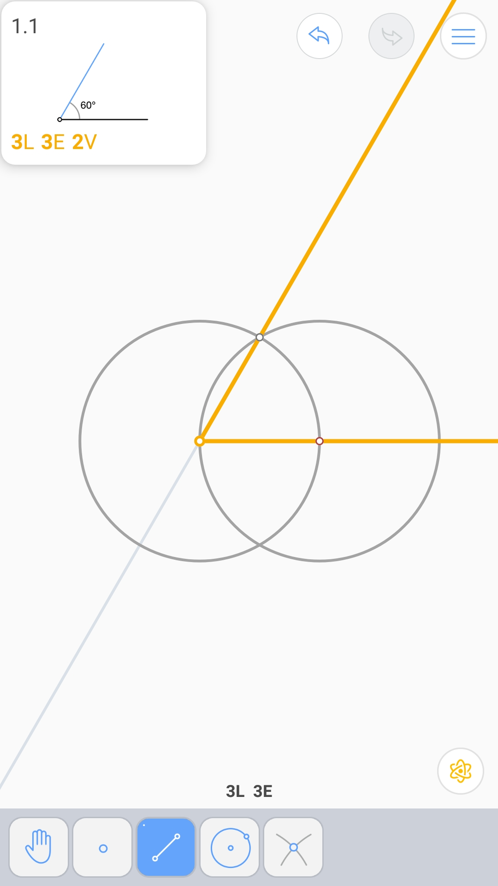

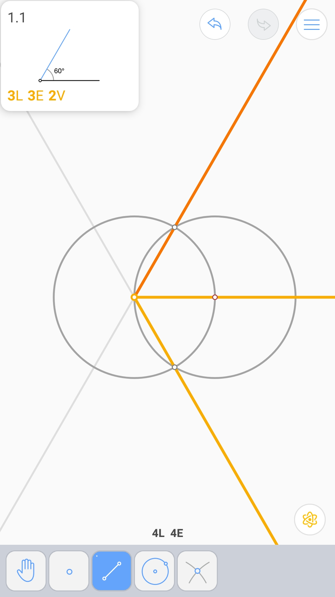

垂直平分线 (3L 3E)
^^^^^^^^^^^^^^^^^^

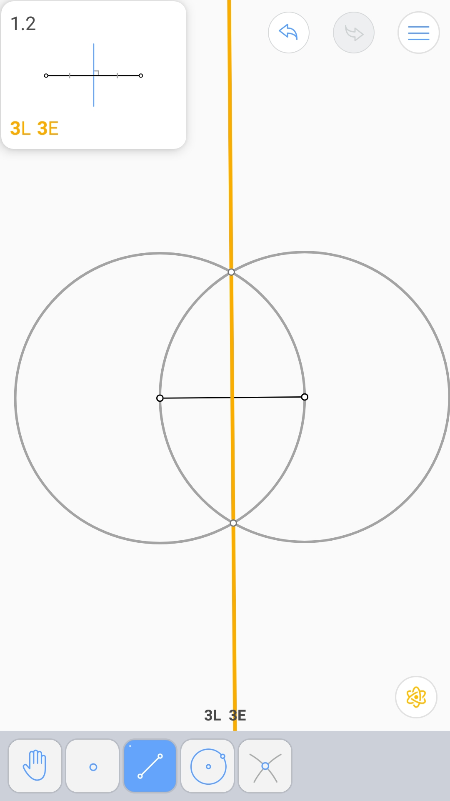

中点 (2L 4E)
^^^^^^^^^^^^

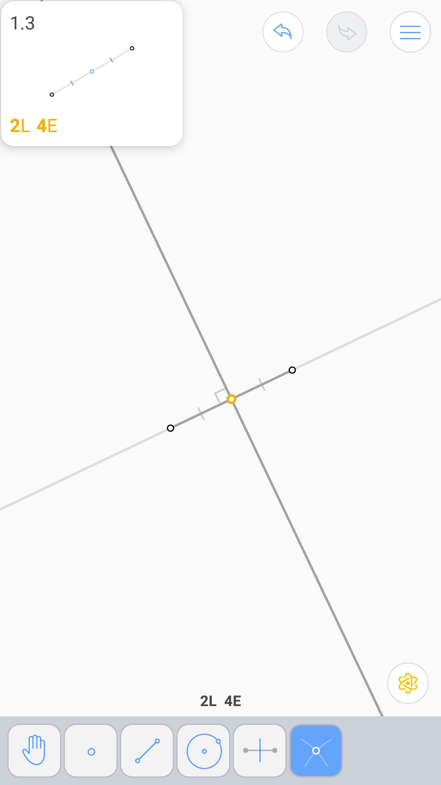

正方形内的圆 (3L 5E)
^^^^^^^^^^^^^^^^^^^^

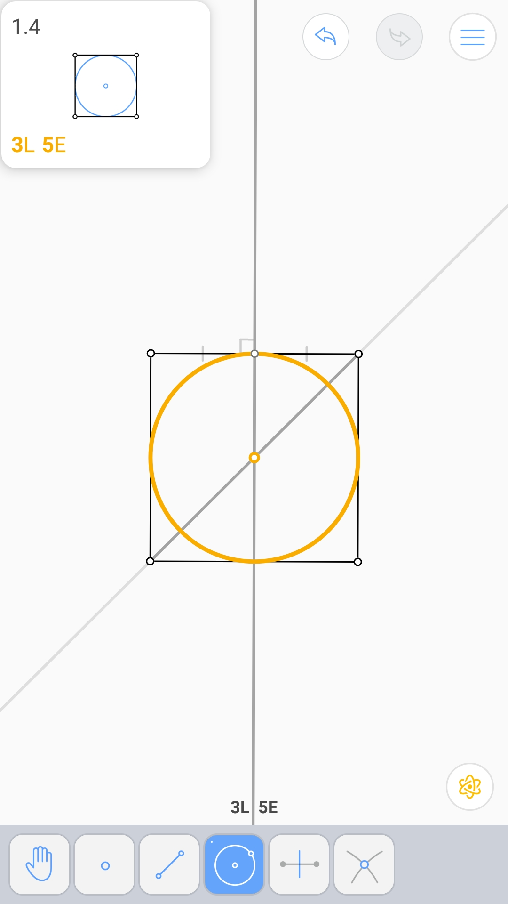

矩形内的菱形 (3L 5E 2V)
^^^^^^^^^^^^^^^^^^^^^^^

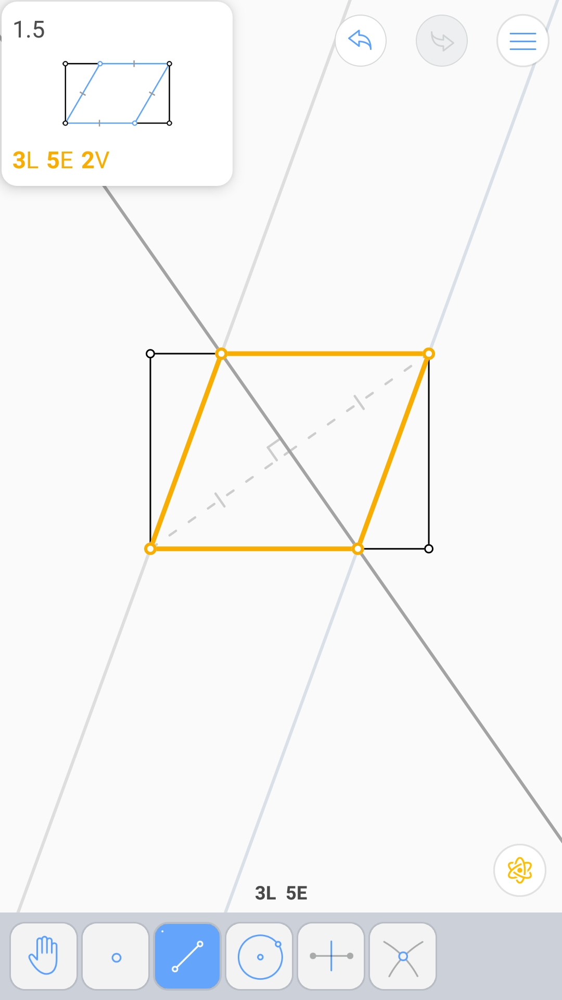

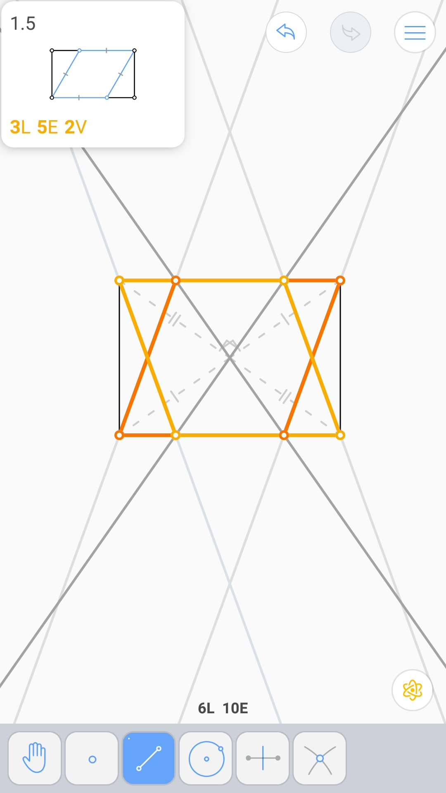

圆心 (2L 5E)
^^^^^^^^^^^^

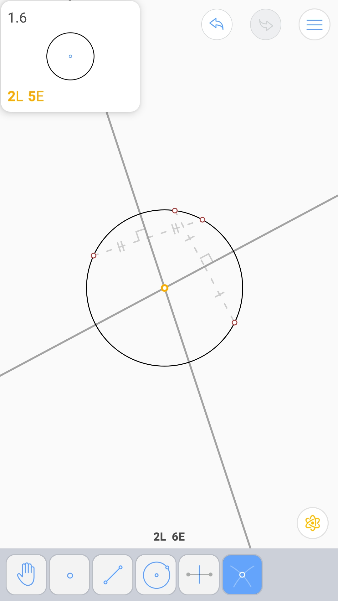

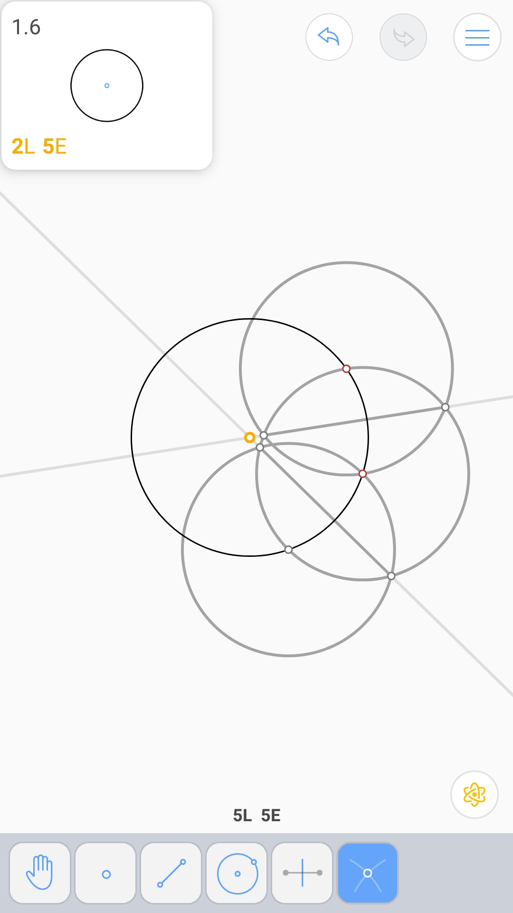

圆内接正方形 (6L 7E)
^^^^^^^^^^^^^^^^^^^^

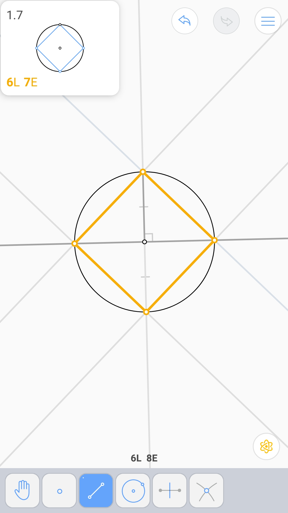

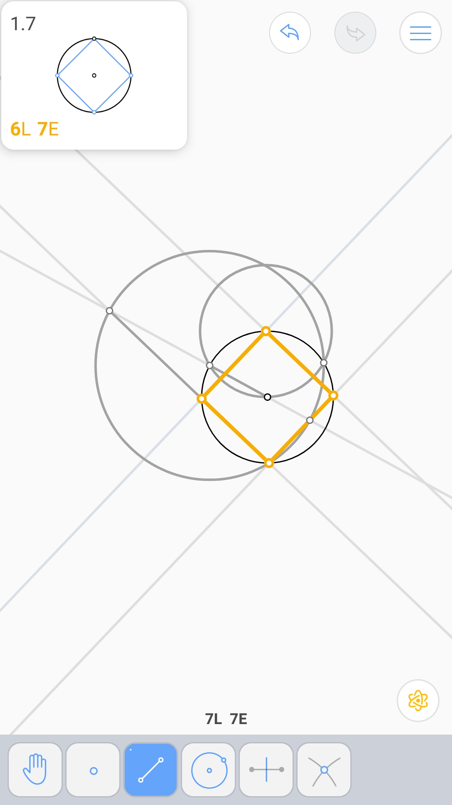
