角平分线 (2L 4E)
^^^^^^^^^^^^^^^^

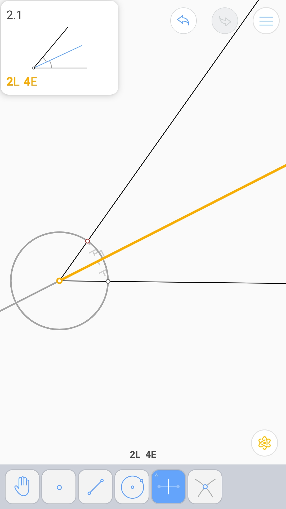

角平分线的交点 (2L 6E)
^^^^^^^^^^^^^^^^^^^^^^

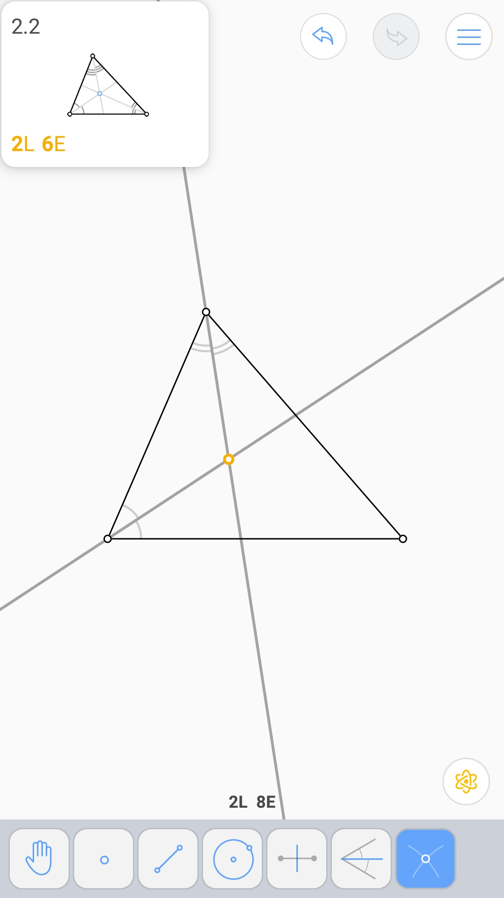

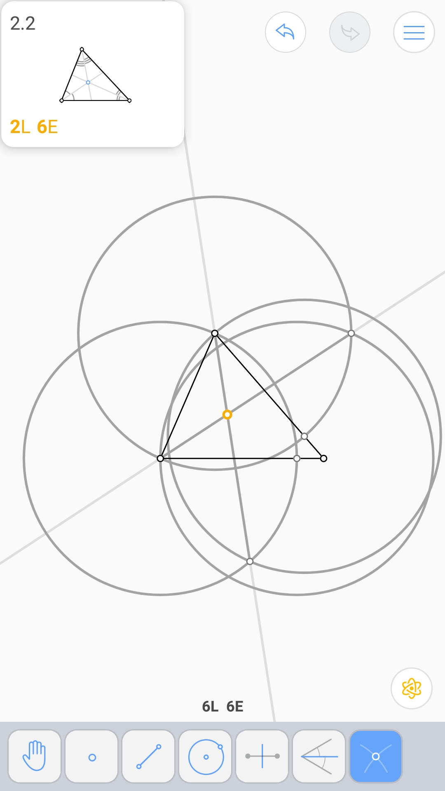

30°角 (3L 3E 2V)
^^^^^^^^^^^^^^^^^

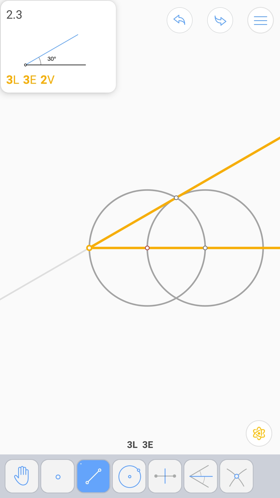

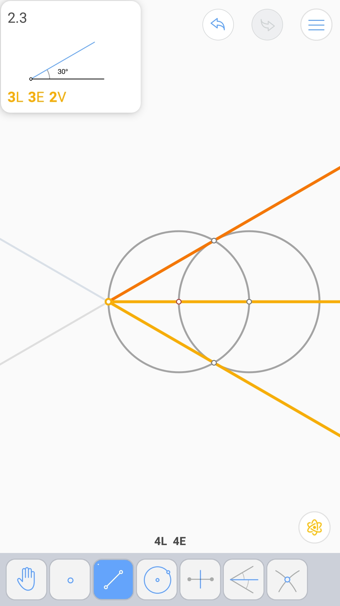

二倍角 (3L 3E 2V)
^^^^^^^^^^^^^^^^^

.. image:: 02.04_3L3EE.jpg

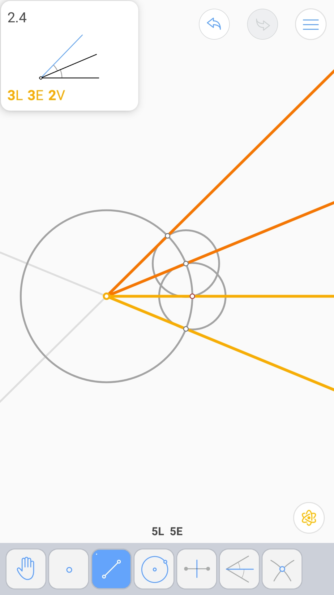

平分矩形 (3L 3E)
^^^^^^^^^^^^^^^^

.. image:: 02.05_3L3E.jpg

过线外一点的垂线 (2L 3E)
^^^^^^^^^^^^^^^^^^^^^^^^

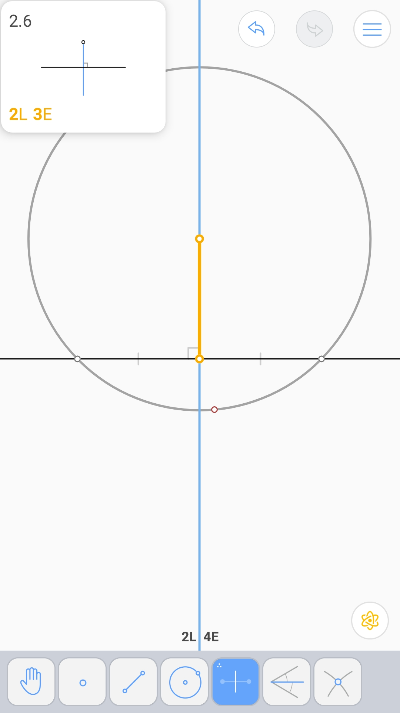

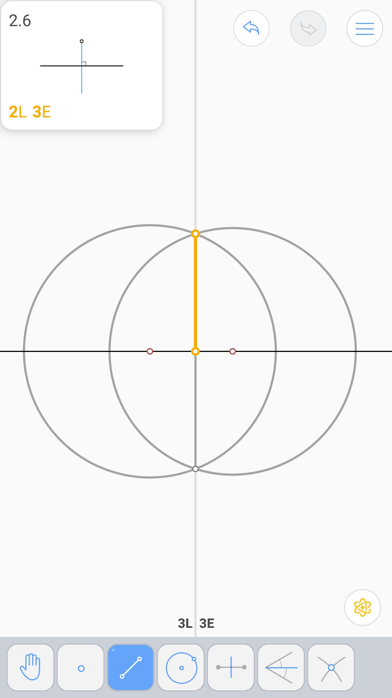

过线上一点的垂线 (1L 3E)
^^^^^^^^^^^^^^^^^^^^^^^^

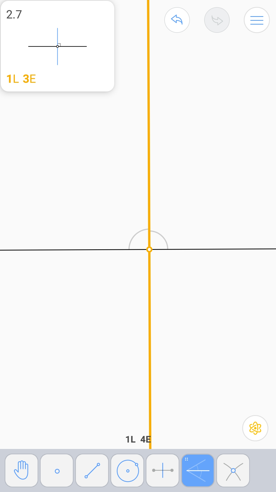

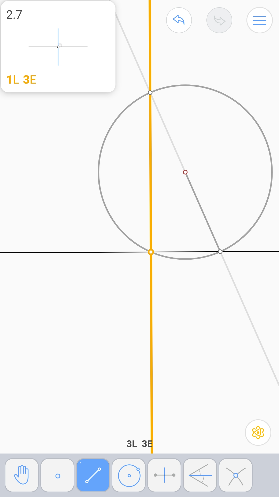

过圆上一点的切线 (2L 3E)
^^^^^^^^^^^^^^^^^^^^^^^^

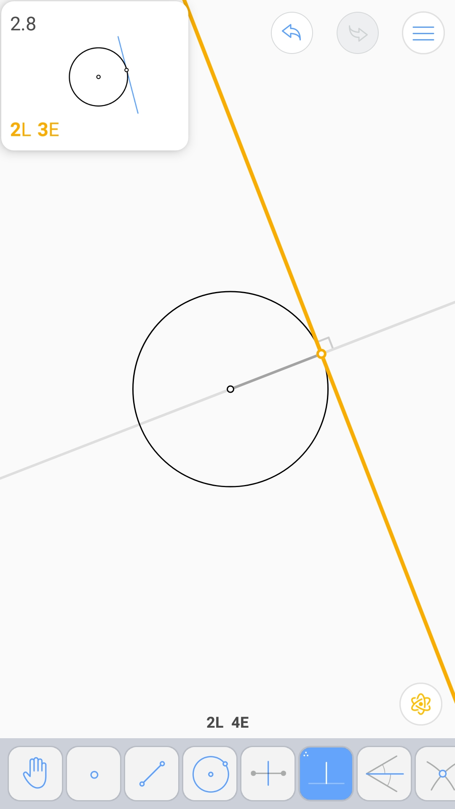

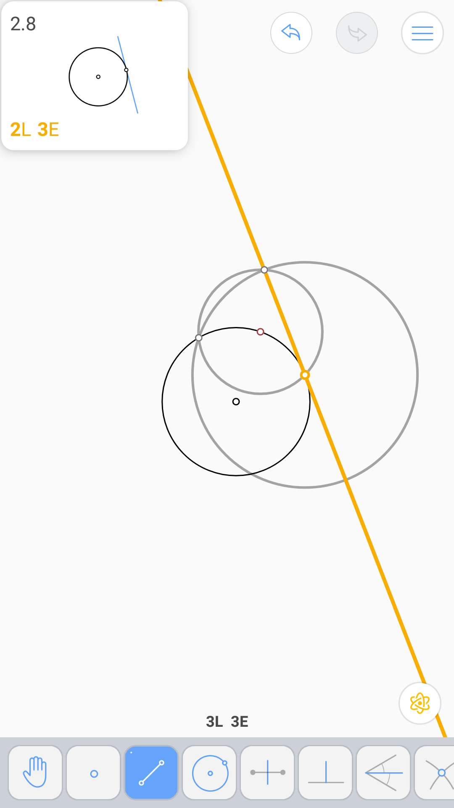

直线的切圆 (2L 4E)
^^^^^^^^^^^^^^^^^^

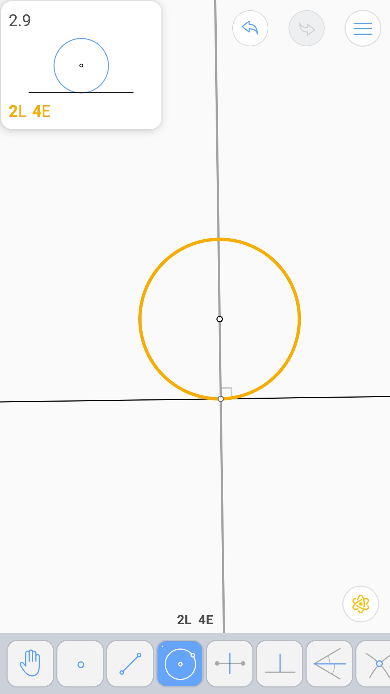

菱形内的圆 (4L 6E)
^^^^^^^^^^^^^^^^^^

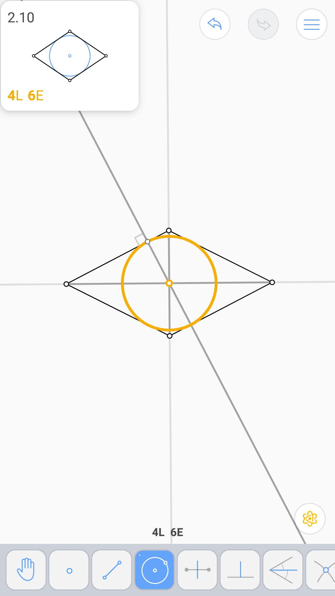
