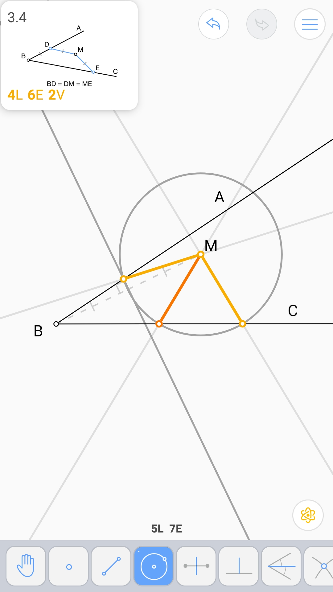

弦的中点 (2L 4E)
^^^^^^^^^^^^^^^^

由一角和垂心确定的三角形 (3L 6E)
^^^^^^^^^^^^^^^^^^^^^^^^^^^^^^^^

垂分线的交点 (2L 2E)
^^^^^^^^^^^^^^^^^^^^

三条等长线段 - 1 (4L 6E 2V)
^^^^^^^^^^^^^^^^^^^^^^^^^^^

过一点并切于一直线的圆 (3L 6E)
^^^^^^^^^^^^^^^^^^^^^^^^^^^^^^

.. image:: 03.05_3L.jpg

梯形底的中点 (3L 5E)
^^^^^^^^^^^^^^^^^^^^

.. image:: 03.06_3L.jpg

45°角 (2L 5E 2V)
^^^^^^^^^^^^^^^^^

菱形 (5L 7E 4V)
^^^^^^^^^^^^^^^

四边形的中心 (4L 10E)
^^^^^^^^^^^^^^^^^^^^^

