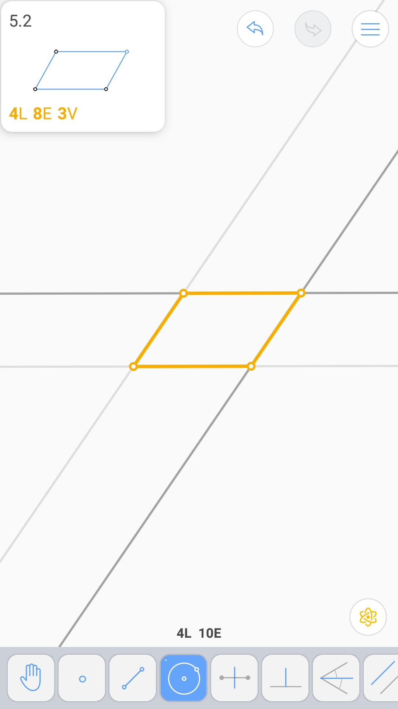

平行线 (2L 4E)
^^^^^^^^^^^^^^

由三个顶点确定的平行四边形 (4L 8E 3V)
^^^^^^^^^^^^^^^^^^^^^^^^^^^^^^^^^^^^^

到两点距离相等的线 - 1 (2L 4E)
^^^^^^^^^^^^^^^^^^^^^^^^^^^^^^

到两点距离相等的线 - 2 (3L 5E)
^^^^^^^^^^^^^^^^^^^^^^^^^^^^^^

哈希 (2L 4E 2V)
^^^^^^^^^^^^^^^

移动角 (2L 6E)
^^^^^^^^^^^^^^

和两直线线等距的直线 (2L 5E)
^^^^^^^^^^^^^^^^^^^^^^^^^^^^

外切正方形 (6L 11E)
^^^^^^^^^^^^^^^^^^^

正方形内的正方形 (6L 7E)
^^^^^^^^^^^^^^^^^^^^^^^^

和正方形相切的圆 (3L 6E 4V)
^^^^^^^^^^^^^^^^^^^^^^^^^^^

.. image:: 05.10_4V.jpg

正六边形 (7L 8E 2V)
^^^^^^^^^^^^^^^^^^^

