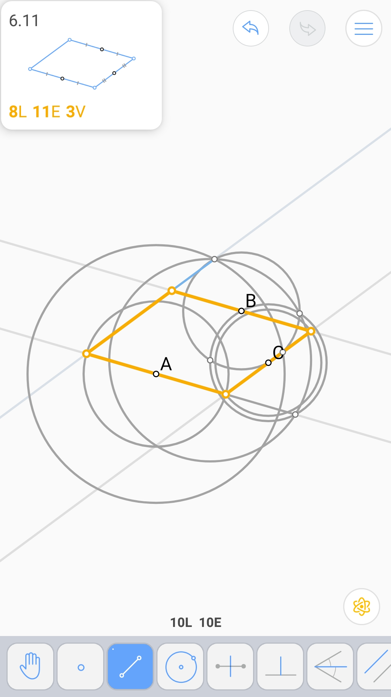

中心对称 (4L 5E)
^^^^^^^^^^^^^^^^

轴对称 (5L 5E)
^^^^^^^^^^^^^^

复制线段 (3L 4E 2V)
^^^^^^^^^^^^^^^^^^^

.. image:: 06.03_4E.jpg

给定角平分线 (4L 4E)
^^^^^^^^^^^^^^^^^^^^

圆规 (4L 5E)
^^^^^^^^^^^^

平移线段 (2L 6E 2V)
^^^^^^^^^^^^^^^^^^^

由三边确定的三角形 (4L 12E 4V)
^^^^^^^^^^^^^^^^^^^^^^^^^^^^^^

.. image:: 06.07_4V.jpg

平行四边形 (5L 8E)
^^^^^^^^^^^^^^^^^^

九点圆 (5L 9E)
^^^^^^^^^^^^^^

对称的四条直线 (3L 4E 3V)
^^^^^^^^^^^^^^^^^^^^^^^^^

由三个中点确定的平行四边形 (7L 10E 3V)
^^^^^^^^^^^^^^^^^^^^^^^^^^^^^^^^^^^^^^

