周长平分线 (4L 7E 3V)
^^^^^^^^^^^^^^^^^^^^^

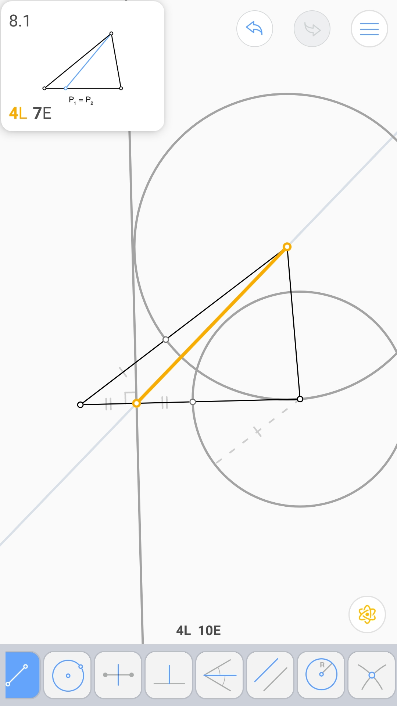

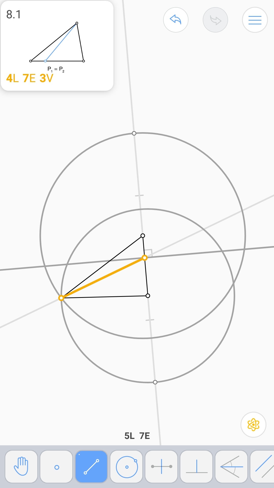

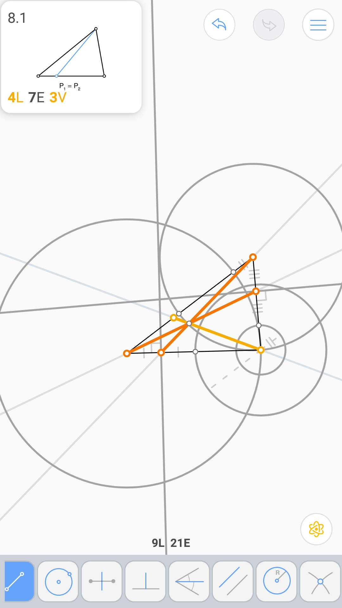

三等分54°角 (4L 5E)
^^^^^^^^^^^^^^^^^^^^

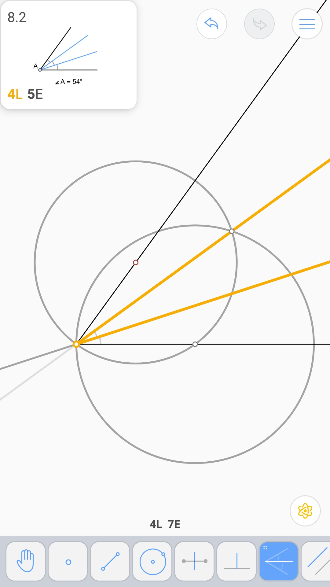

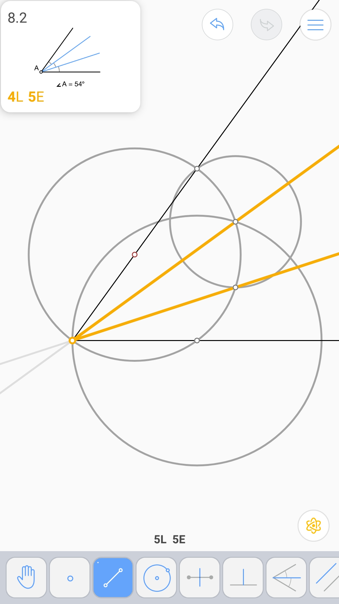

内角 (2L 4E 2V)
^^^^^^^^^^^^^^^

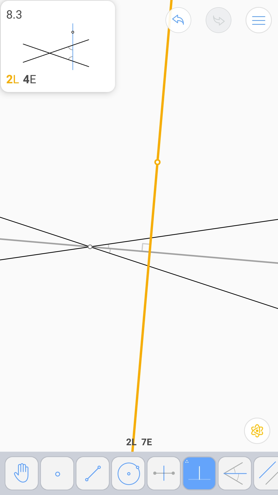

.. image:: 08.03_4E.jpg

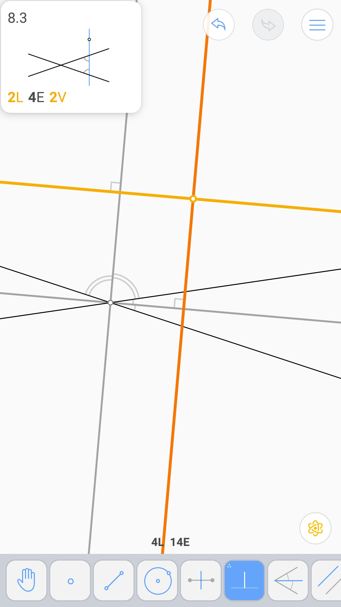

正八边形 (9L 13E 2V)
^^^^^^^^^^^^^^^^^^^^

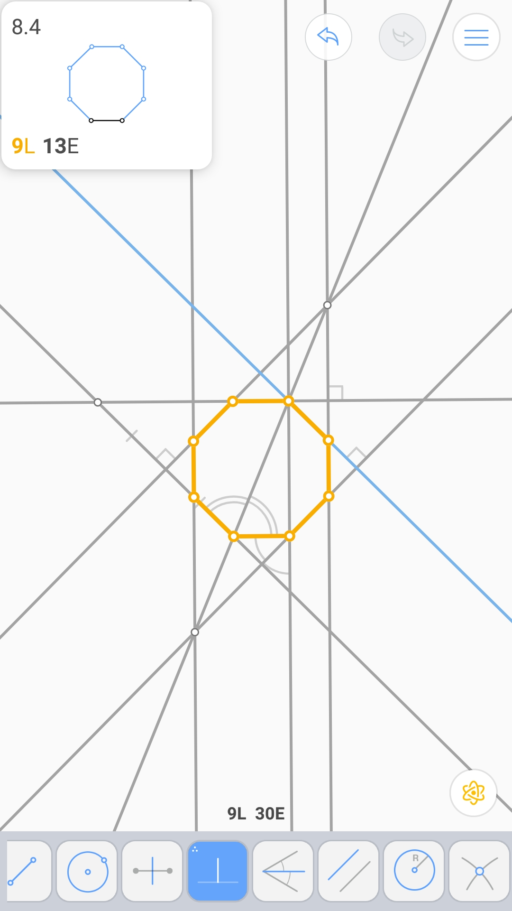

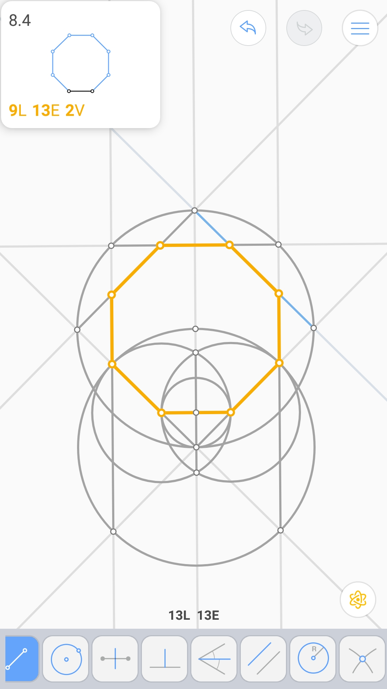

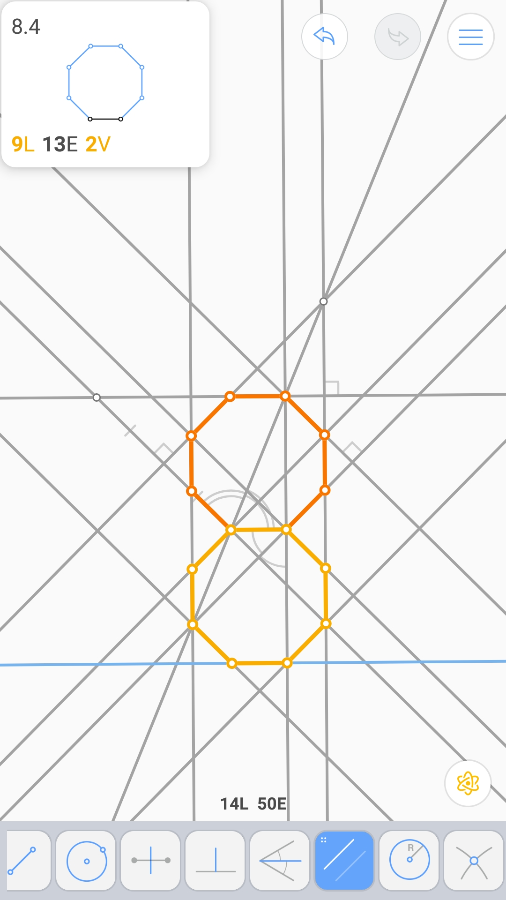

三角形劈裂 (3L 7E 3V)
^^^^^^^^^^^^^^^^^^^^^

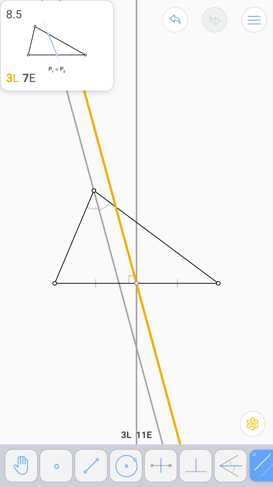

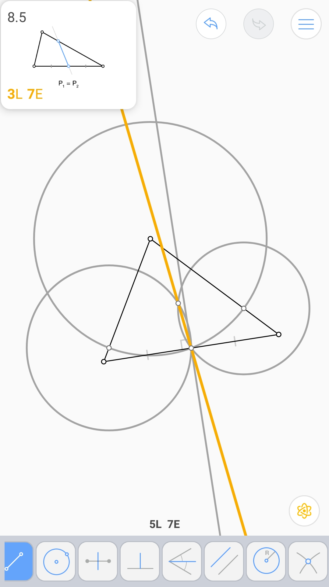

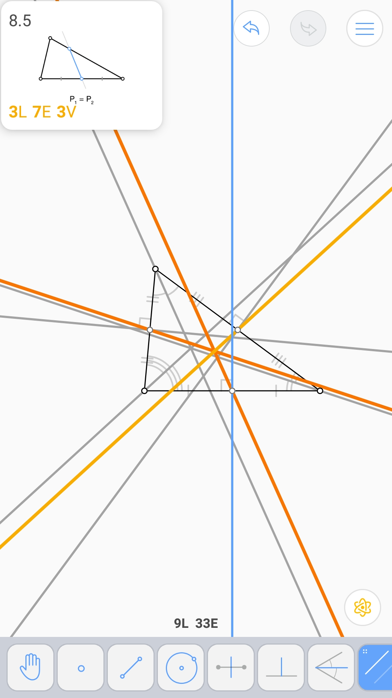

Torricelli点 (4L 5E 2V)
^^^^^^^^^^^^^^^^^^^^^^^

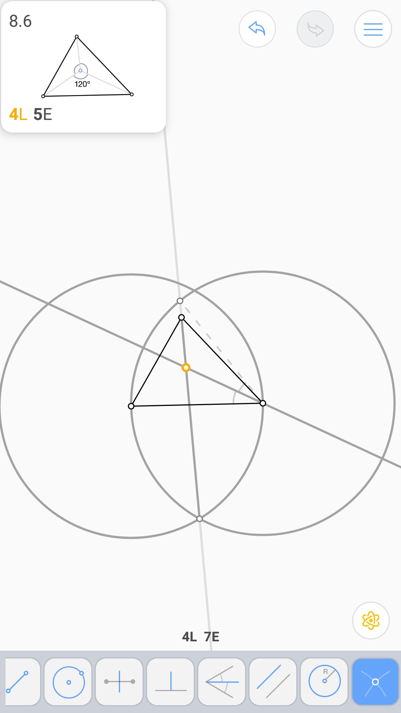

.. image:: 08.06_5E.jpg

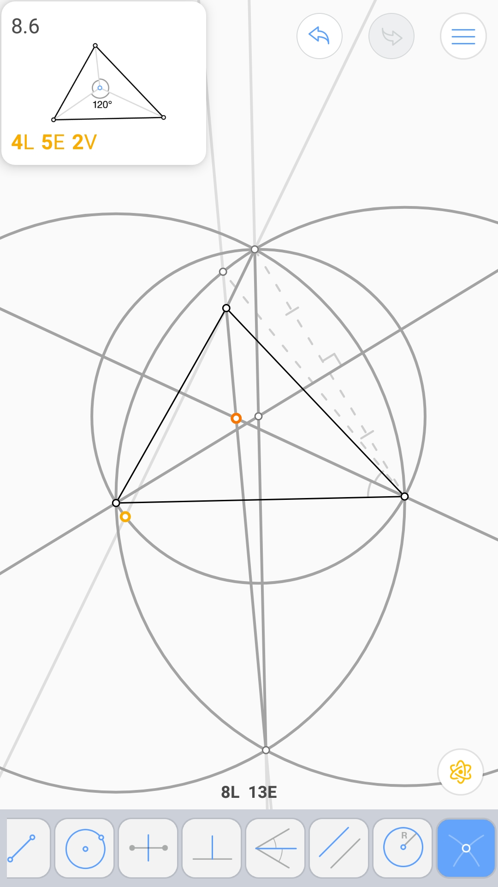

与四点相同距离的圆 (6L 12E 3V)
^^^^^^^^^^^^^^^^^^^^^^^^^^^^^^

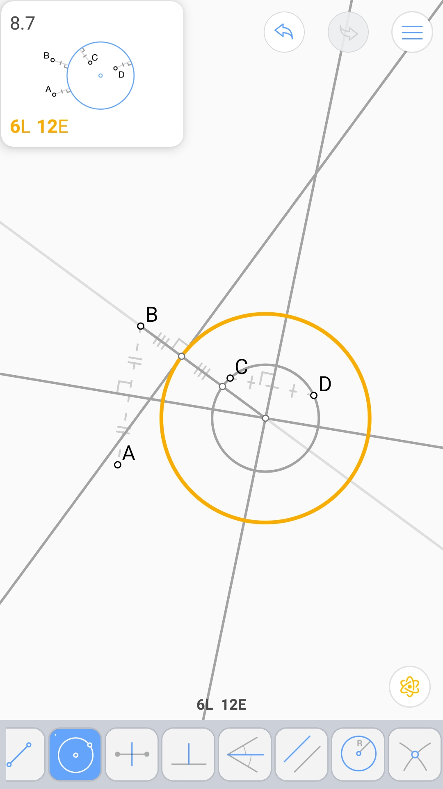

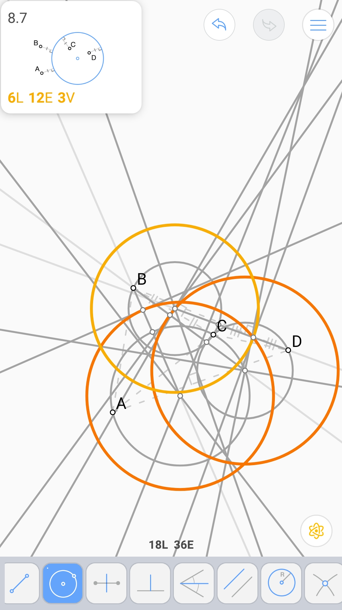
