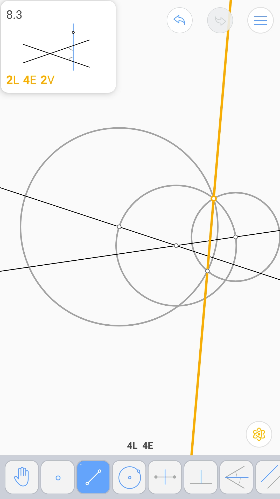
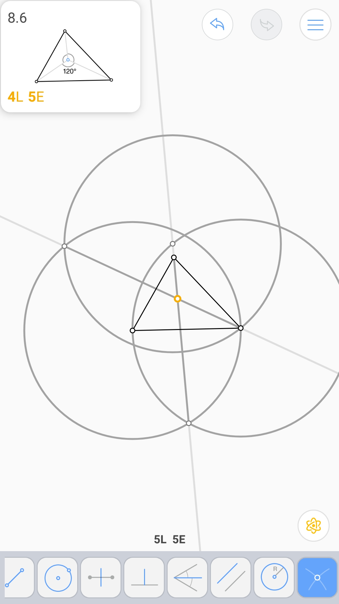

周长平分线 (4L 7E 3V)
^^^^^^^^^^^^^^^^^^^^^

三等分54°角 (4L 5E)
^^^^^^^^^^^^^^^^^^^^

内角 (2L 4E 2V)
^^^^^^^^^^^^^^^

正八边形 (9L 13E 2V)
^^^^^^^^^^^^^^^^^^^^

三角形劈裂 (3L 7E 3V)
^^^^^^^^^^^^^^^^^^^^^

Torricelli点 (4L 5E 2V)
^^^^^^^^^^^^^^^^^^^^^^^

与四点相同距离的圆 (6L 12E 3V)
^^^^^^^^^^^^^^^^^^^^^^^^^^^^^^

