最小周长 - 1 (6L 6E)
^^^^^^^^^^^^^^^^^^^^

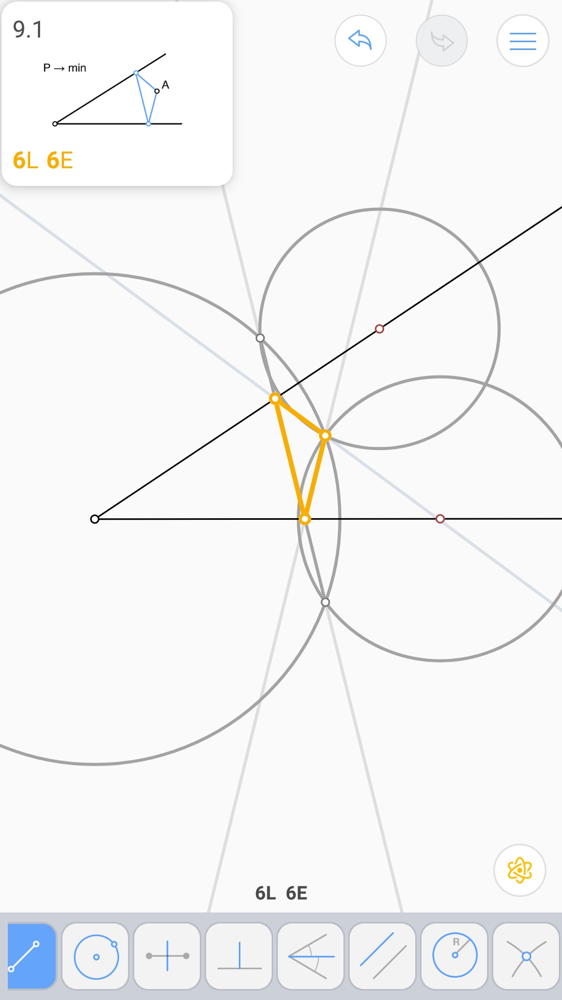

第三比例项 (3L 3E)
^^^^^^^^^^^^^^^^^^

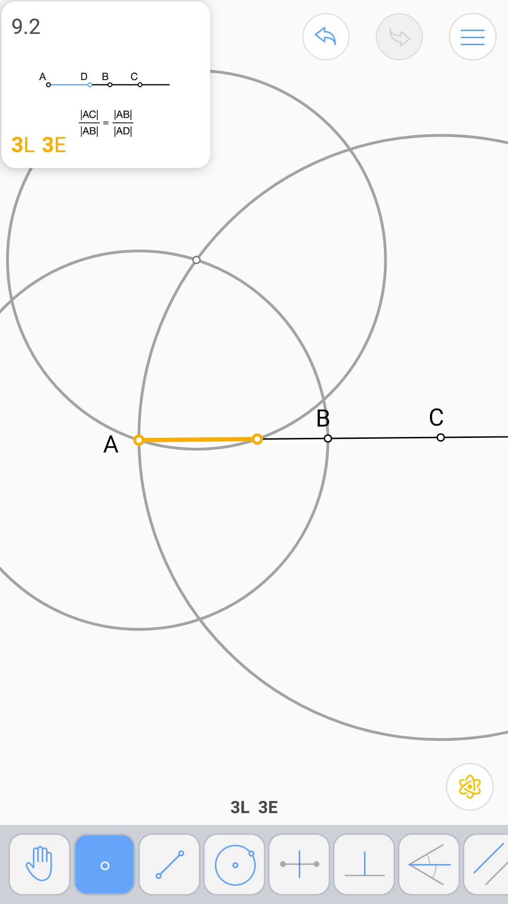

梯形两底的调和平均 (3L 5E)
^^^^^^^^^^^^^^^^^^^^^^^^^^

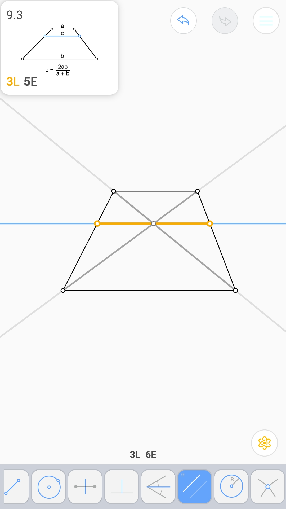

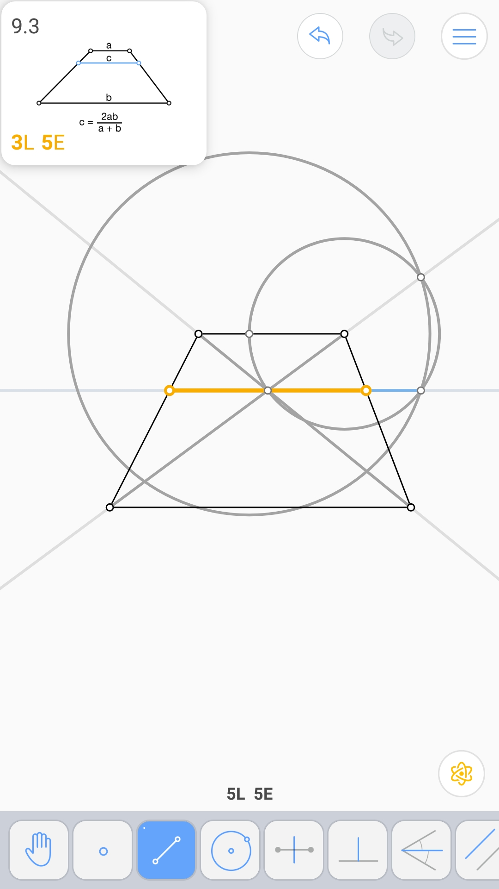

过线外一点的垂线* (5L 5E)
^^^^^^^^^^^^^^^^^^^^^^^^^

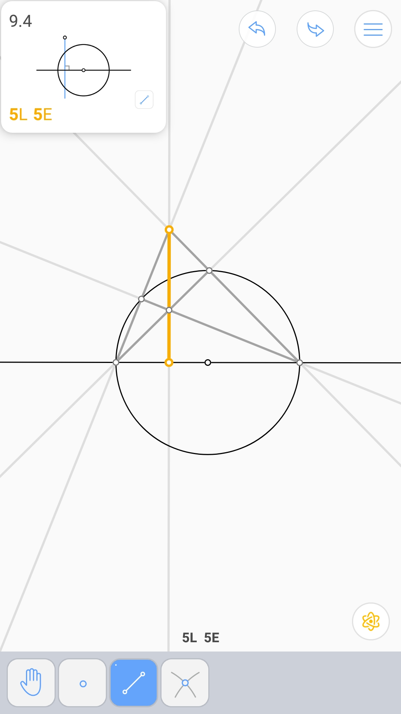

中点* (5L 5E)
^^^^^^^^^^^^^

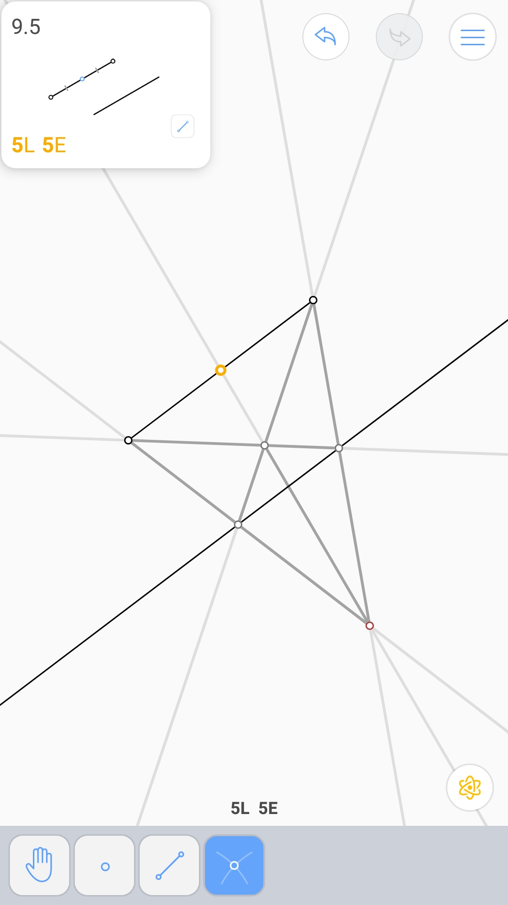

由梯形对角线三等分的线段 (3L 5E 2V)
^^^^^^^^^^^^^^^^^^^^^^^^^^^^^^^^^^^

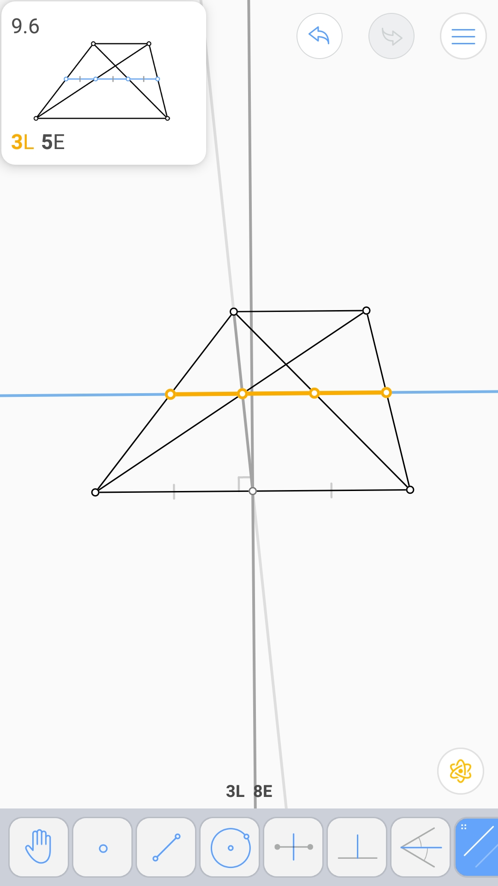

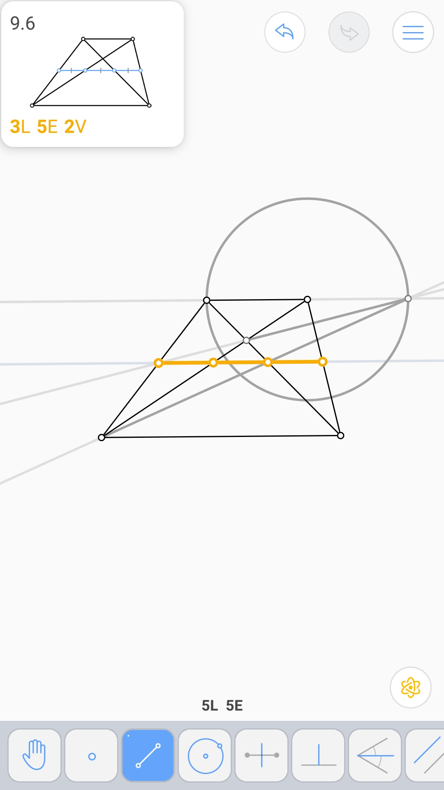

.. image:: 09.06_2V.jpg

最小周长 - 2 (6L 8E)
^^^^^^^^^^^^^^^^^^^^

.. image:: 09.07_6L.jpg

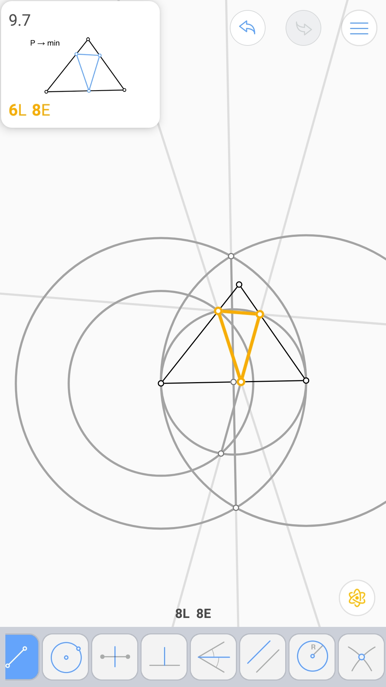

线段的调和平均 (4L 4E)
^^^^^^^^^^^^^^^^^^^^^^

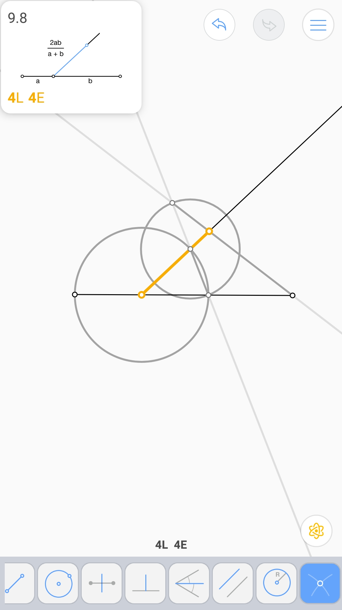

由一个角和重心确定的三角形 (5L 7E)
^^^^^^^^^^^^^^^^^^^^^^^^^^^^^^^^^^

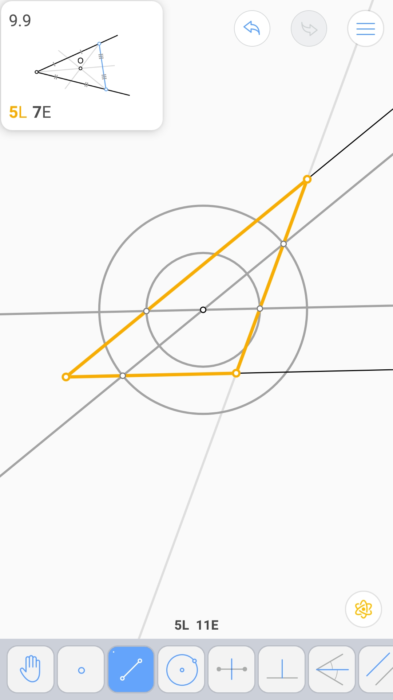

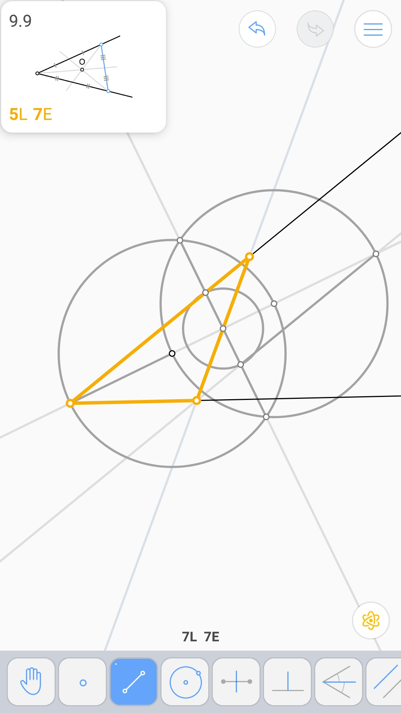

三角形中位线 (2L 5E 3V)
^^^^^^^^^^^^^^^^^^^^^^^

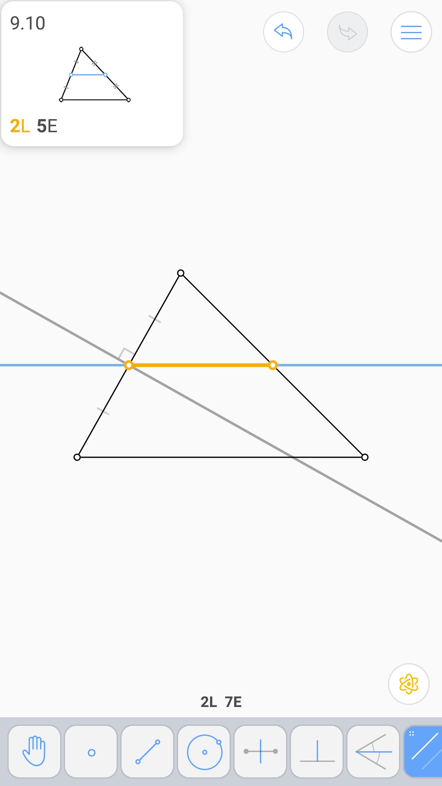

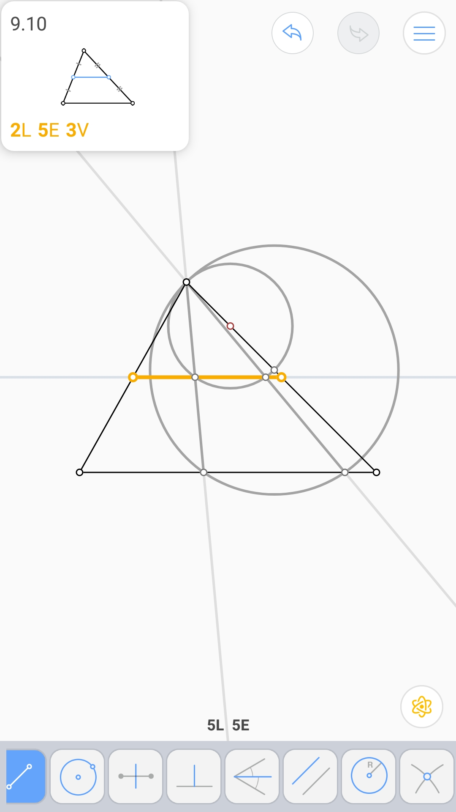

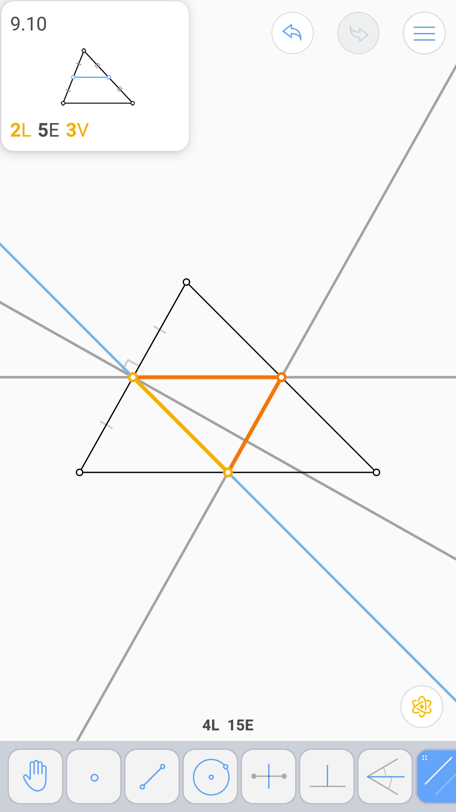
