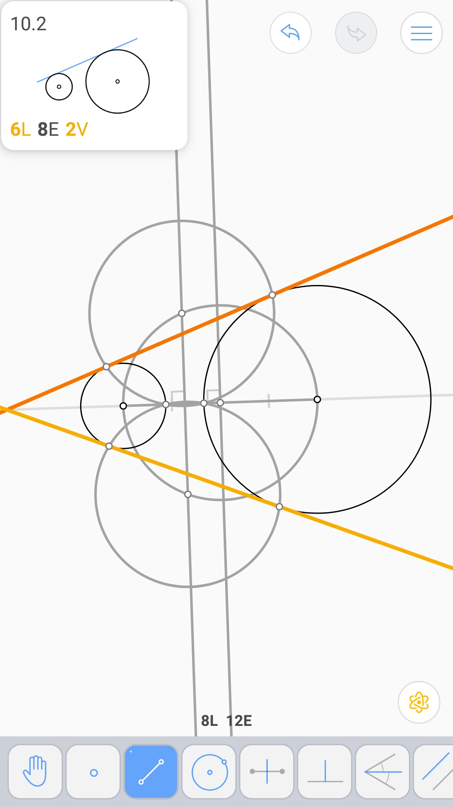
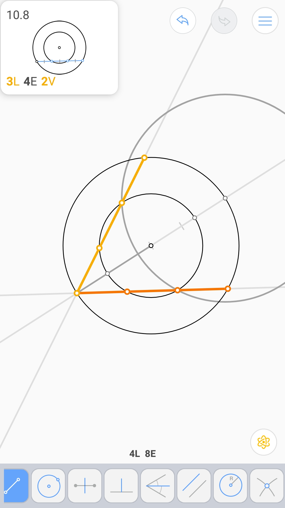

圆的切线 (4L 5E 2V)
^^^^^^^^^^^^^^^^^^^

外公切线 (6L 8E 2V)
^^^^^^^^^^^^^^^^^^^

内公切线 (6L 8E 2V)
^^^^^^^^^^^^^^^^^^^

旋转90° (5L 9E)
^^^^^^^^^^^^^^^^

旋转60° (4L 4E)
^^^^^^^^^^^^^^^^

三等分线段 (5L 6E)
^^^^^^^^^^^^^^^^^^

三等分线段* (8L 8E)
^^^^^^^^^^^^^^^^^^^

.. image:: 10.07_8L8E.jpg

三等分圆内弦 (3L 4E 2V)
^^^^^^^^^^^^^^^^^^^^^^^

三个圆 - 1 (7L 10E)
^^^^^^^^^^^^^^^^^^^

平分割线 (4L 5E 2V)
^^^^^^^^^^^^^^^^^^^

.. image:: 10.10_5E.jpg

三个圆 - 2 (9L 14E)
^^^^^^^^^^^^^^^^^^^

旋转中心 (2L 5E 2V)
^^^^^^^^^^^^^^^^^^^

.. image:: 10.12_2V.jpg
