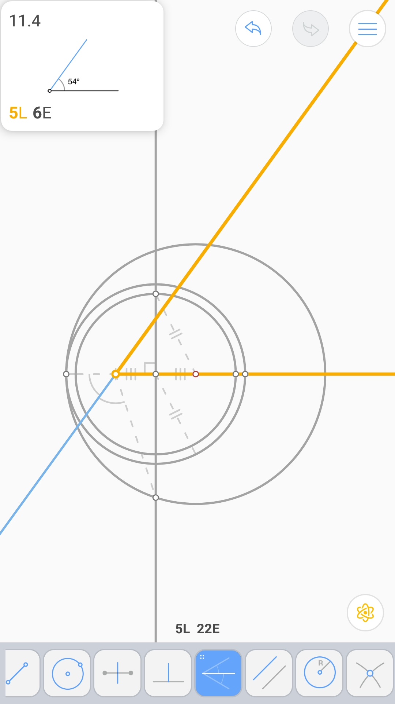
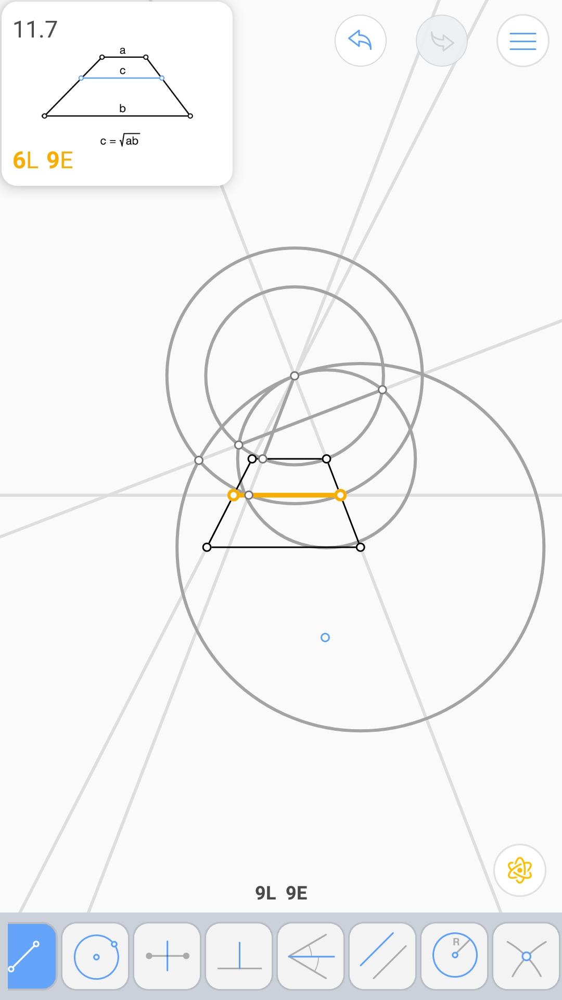
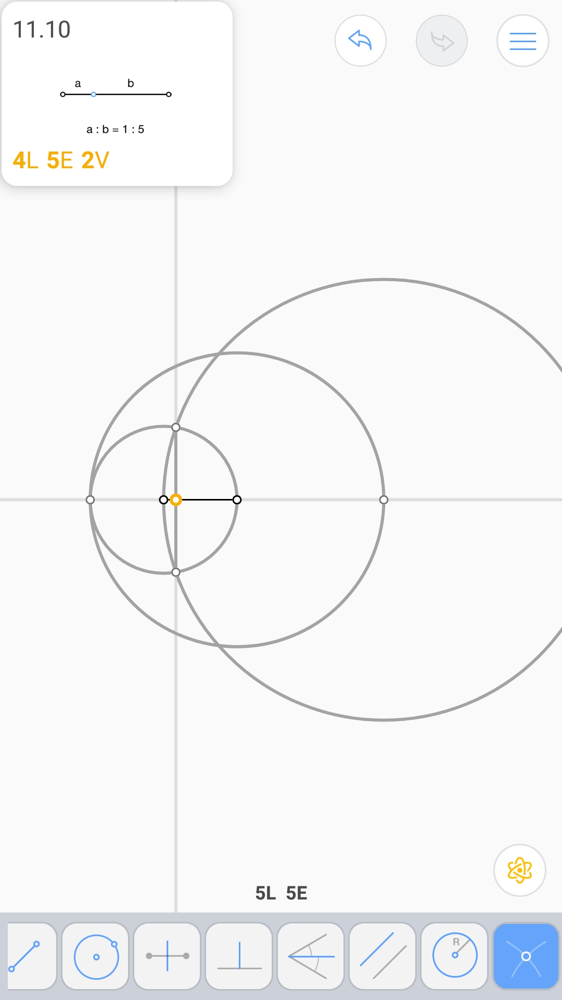

第四比例项 (2L 3E)
^^^^^^^^^^^^^^^^^^

线段的几何平均 (3L 5E)
^^^^^^^^^^^^^^^^^^^^^^

黄金分割 (4L 5E 2V)
^^^^^^^^^^^^^^^^^^^

54°角 (5L 6E 2V)
^^^^^^^^^^^^^^^^^

.. image:: 11.04_6E.jpg

第三条平行线 (7L 7E)
^^^^^^^^^^^^^^^^^^^^

角内的圆 (6L 11E 2V)
^^^^^^^^^^^^^^^^^^^^

梯形两底的几何平均 (6L 9E)
^^^^^^^^^^^^^^^^^^^^^^^^^^

正五边形 (9L 10E)
^^^^^^^^^^^^^^^^^

离角的两边距离和最大的点 (2L 4E)
^^^^^^^^^^^^^^^^^^^^^^^^^^^^^^^^

1:5的比 (4L 5E 2V)
^^^^^^^^^^^^^^^^^^

