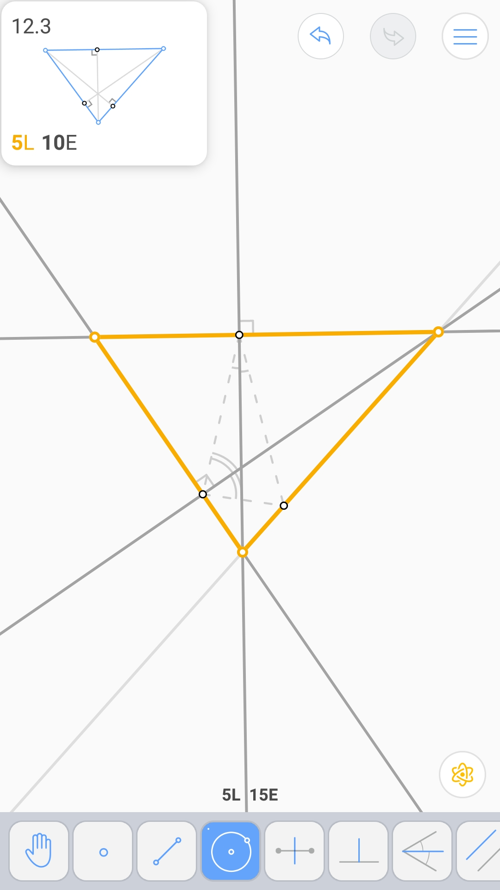

由中点确定的三角形 (5L 8E)
^^^^^^^^^^^^^^^^^^^^^^^^^^

由一边和重心确定的三角形 (6L 7E)
^^^^^^^^^^^^^^^^^^^^^^^^^^^^^^^^

由垂足确定的三角形 (5L 10E)
^^^^^^^^^^^^^^^^^^^^^^^^^^^

由内切圆的切点确定的三角形 (6L 11E)
^^^^^^^^^^^^^^^^^^^^^^^^^^^^^^^^^^^

由三旁心确定的三角形 (9L 11E)
^^^^^^^^^^^^^^^^^^^^^^^^^^^^^

.. image:: 12.05_9L11E.jpg

由中心和边上两点确定的等边三角形 (7L 7E 2V)
^^^^^^^^^^^^^^^^^^^^^^^^^^^^^^^^^^^^^^^^^^^

由两直角边上的点确定的直角三角形 (6L 8E 2V)
^^^^^^^^^^^^^^^^^^^^^^^^^^^^^^^^^^^^^^^^^^^

.. image:: 12.07_6L8E.jpg

斜边和高 (6L 13E 4V)
^^^^^^^^^^^^^^^^^^^^

斜边和直角边 (5L 9E 4V)
^^^^^^^^^^^^^^^^^^^^^^^

由切点做外切等腰三角形 (5L 7E 3V)
^^^^^^^^^^^^^^^^^^^^^^^^^^^^^^^^^

.. image:: 12.10_5L.jpg

