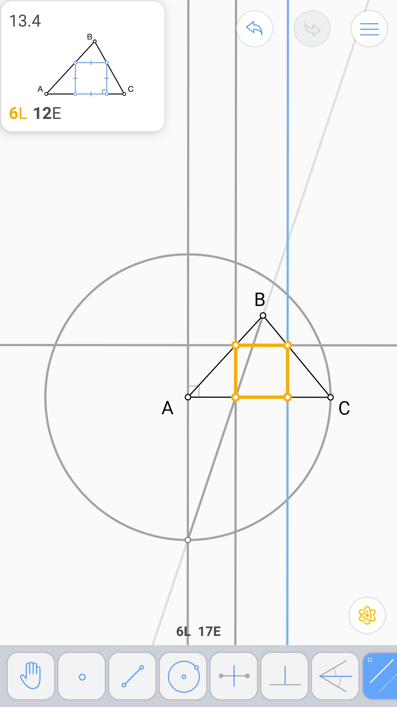
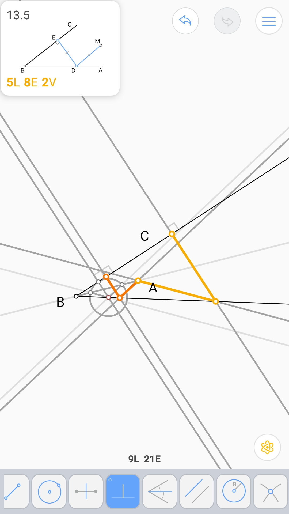
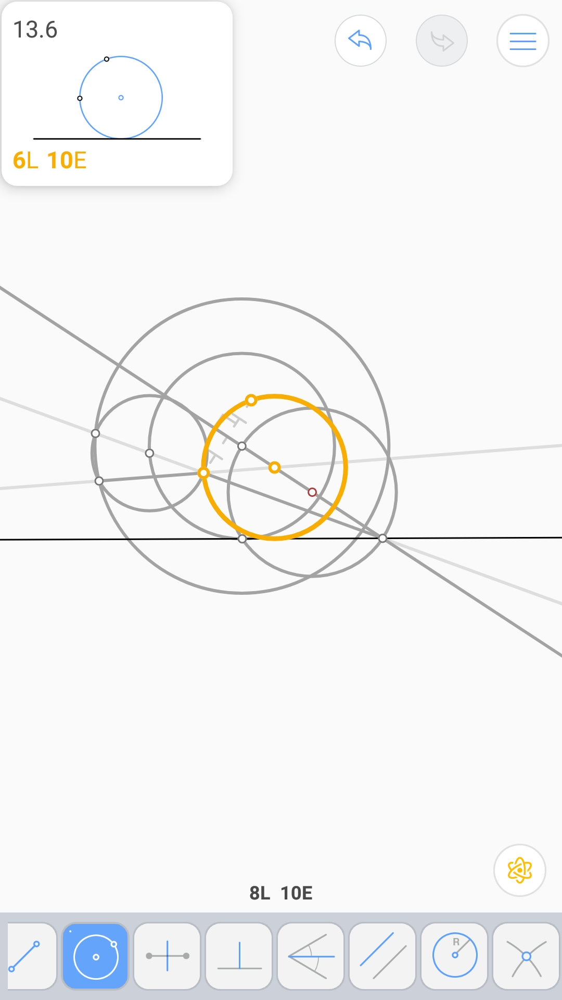

切于一直线和一圆的圆 (4L 8E 2V)
^^^^^^^^^^^^^^^^^^^^^^^^^^^^^^^

等边三角形 - 2 (7L 8E 2V)
^^^^^^^^^^^^^^^^^^^^^^^^^

同心圆上的等边三角形 (6L 8E 4V)
^^^^^^^^^^^^^^^^^^^^^^^^^^^^^^^

三角形内的正方形 (6L 12E)
^^^^^^^^^^^^^^^^^^^^^^^^^

到角的一边和定点距离相等的点 (5L 8E 2V)
^^^^^^^^^^^^^^^^^^^^^^^^^^^^^^^^^^^^^^^

过两点并切于一直线的圆 (6L 10E 2V)
^^^^^^^^^^^^^^^^^^^^^^^^^^^^^^^^^^

内接正方形 - 2 (7L 10E 2V)
^^^^^^^^^^^^^^^^^^^^^^^^^^

对称直线 (5L 5E)
^^^^^^^^^^^^^^^^

边过四个点的正方形 (7L 15E 2V)
^^^^^^^^^^^^^^^^^^^^^^^^^^^^^^

