三角形内的菱形 (3L 8E)
^^^^^^^^^^^^^^^^^^^^^^

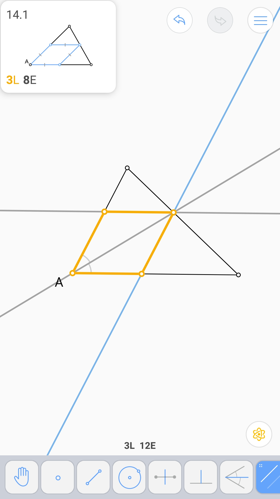

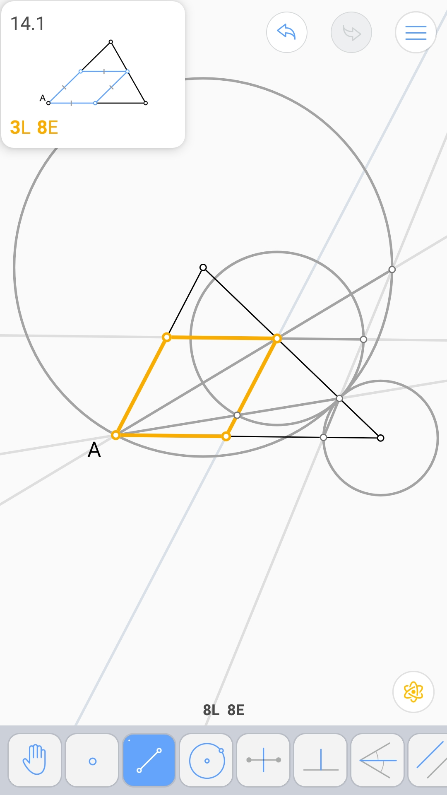

切于两圆的圆 (4L 7E 2V)
^^^^^^^^^^^^^^^^^^^^^^^

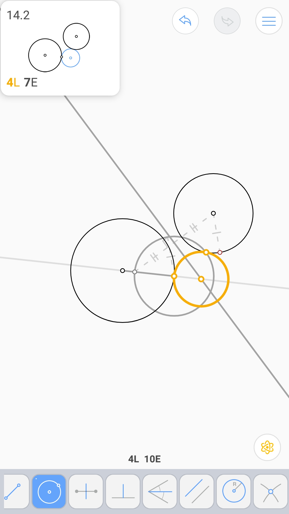

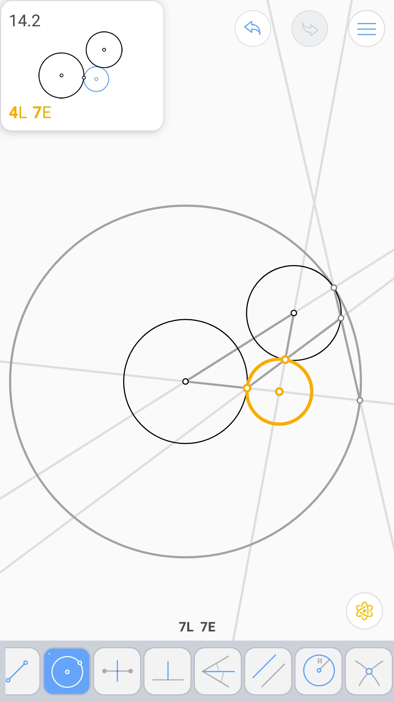

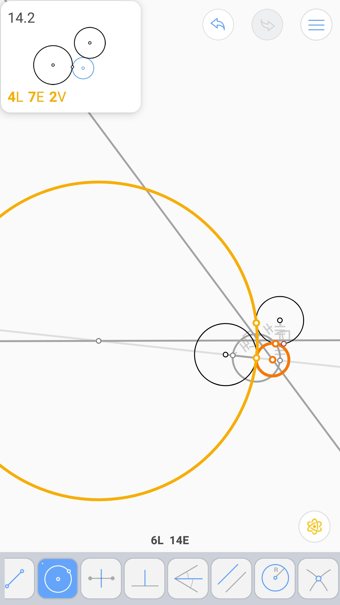

由斜边上内切圆的切点确定的直角三角形 (6L 9E 2V)
^^^^^^^^^^^^^^^^^^^^^^^^^^^^^^^^^^^^^^^^^^^^^^^

.. image:: 14.03_6L.jpg

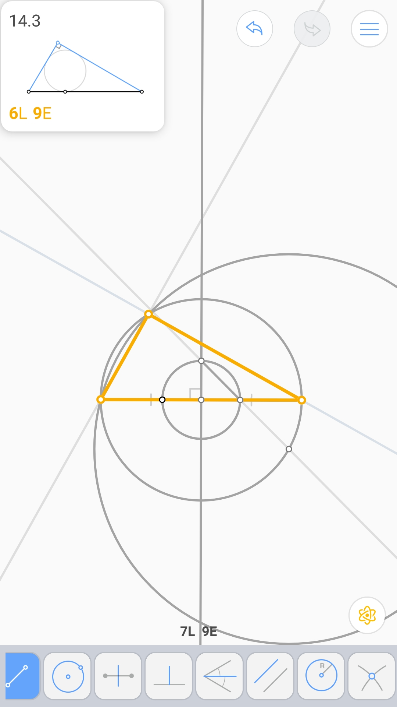

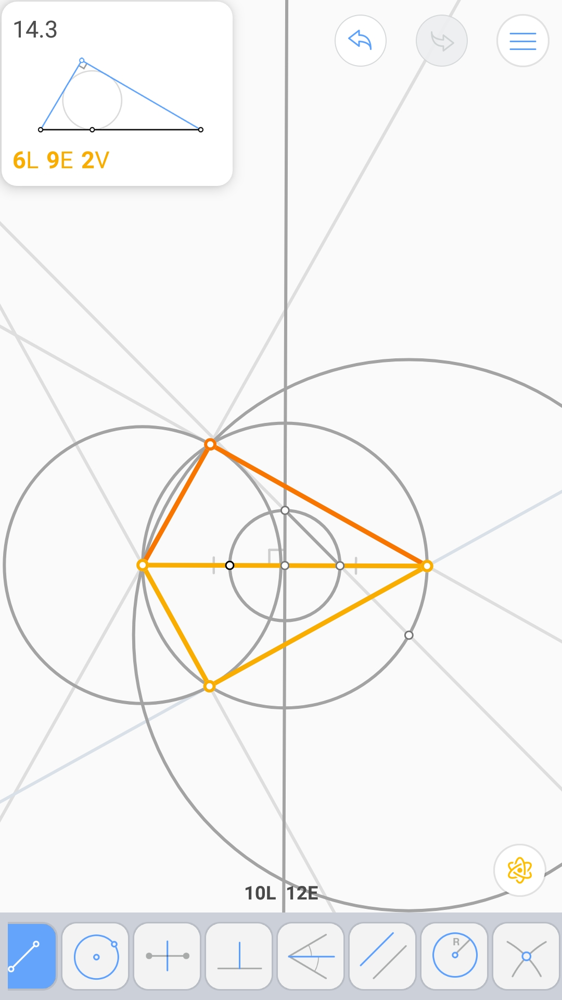

四条线上的平行四边形 (8L 12E 2V)
^^^^^^^^^^^^^^^^^^^^^^^^^^^^^^^^

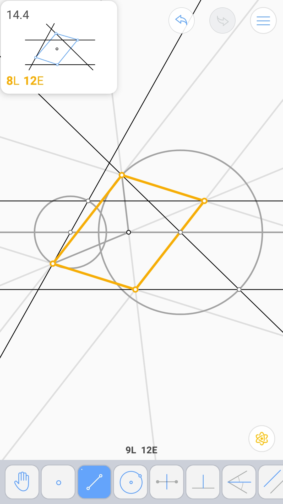

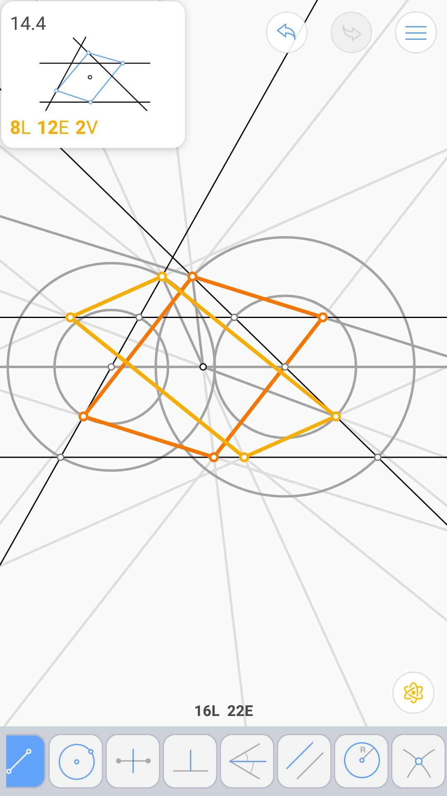

鞋匠刀问题 (5L 7E 2V)
^^^^^^^^^^^^^^^^^^^^^

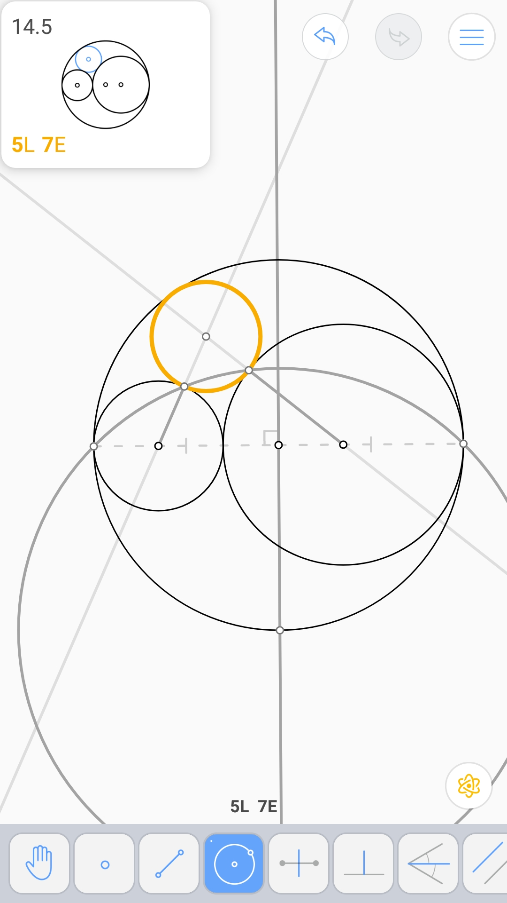

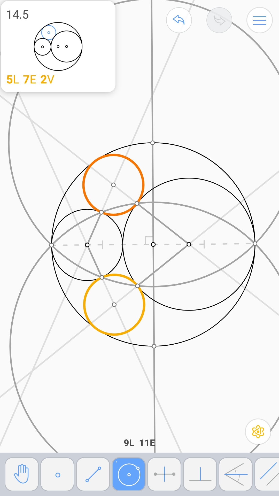
