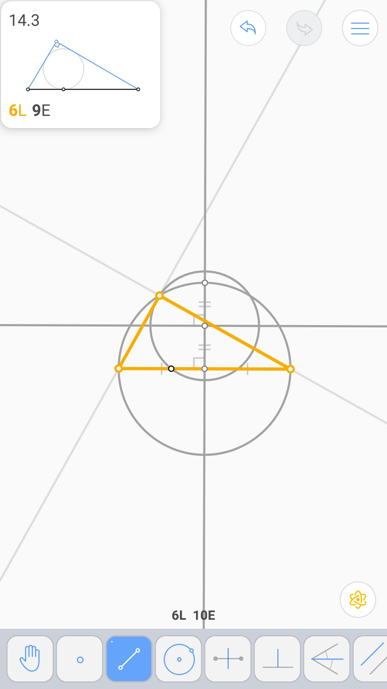

三角形内的菱形 (3L 8E)
^^^^^^^^^^^^^^^^^^^^^^

切于两圆的圆 (4L 7E 2V)
^^^^^^^^^^^^^^^^^^^^^^^

.. image:: 14.02_2V.jpg

由斜边上内切圆的切点确定的直角三角形 (6L 9E 2V)
^^^^^^^^^^^^^^^^^^^^^^^^^^^^^^^^^^^^^^^^^^^^^^^

.. image:: 14.03_9E.jpg

四条线上的平行四边形 (8L 12E 2V)
^^^^^^^^^^^^^^^^^^^^^^^^^^^^^^^^

鞋匠刀问题 (5L 7E 2V)
^^^^^^^^^^^^^^^^^^^^^

.. image:: 14.05_2V.jpg
