============
Euclidea攻略
============

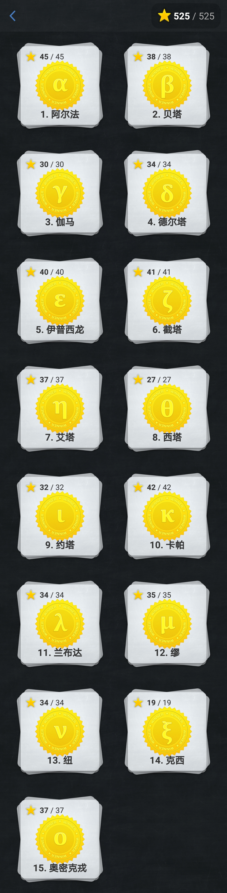

------
阿尔法
------

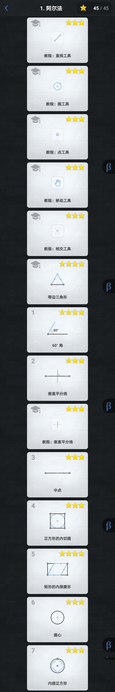

----
贝塔
----

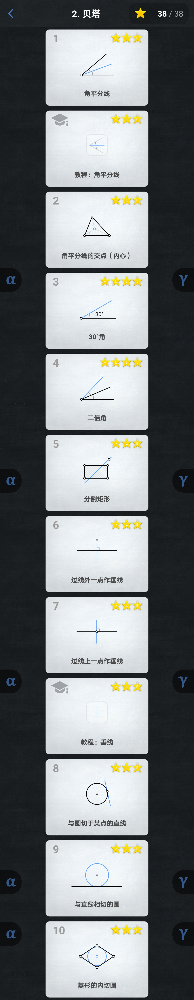

----
伽马
----

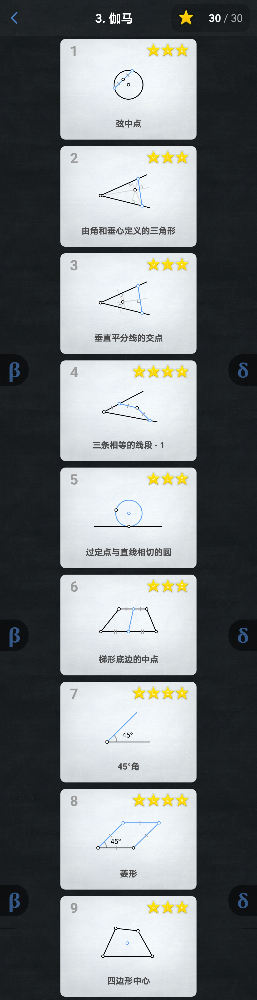

------
德尔塔
------

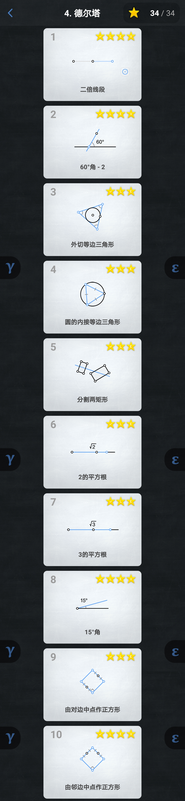

--------
伊普西龙
--------

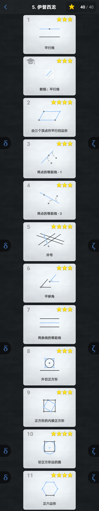

----
截塔
----

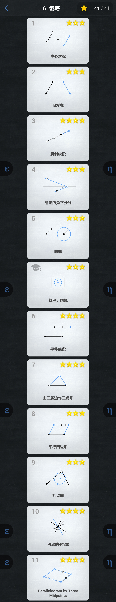

----
艾塔
----

.. image:: 07.Eta/07.Eta.jpg

----
西塔
----

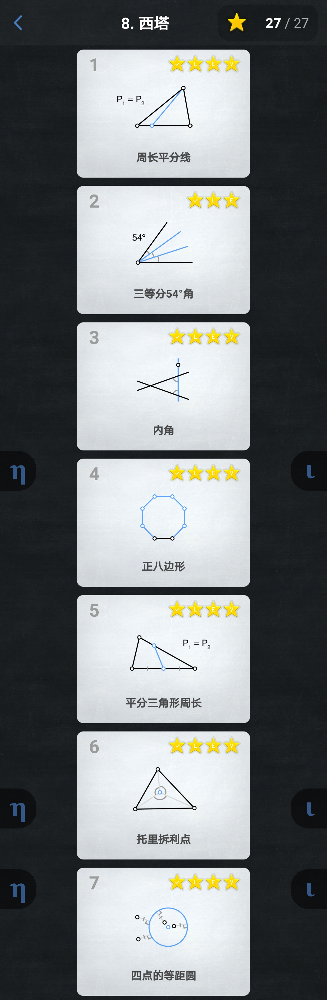

----
约塔
----

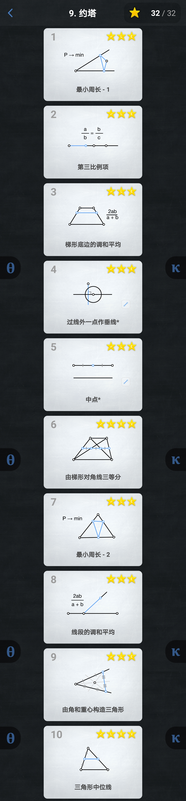

----
卡帕
----

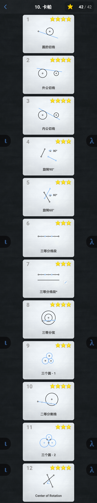

------
兰布达
------

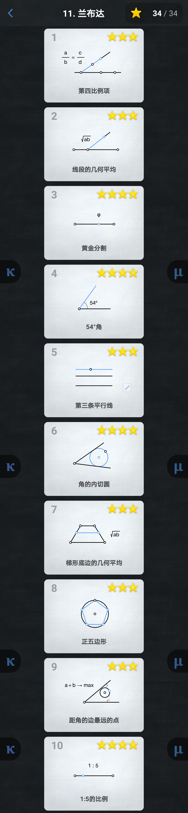

--
缪
--

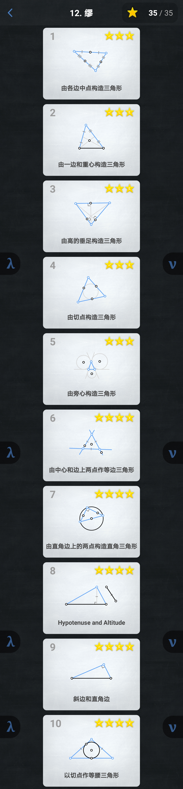

--
纽
--

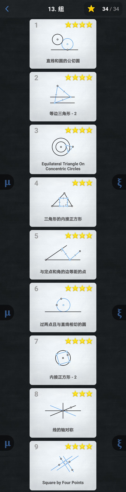

----
克西
----

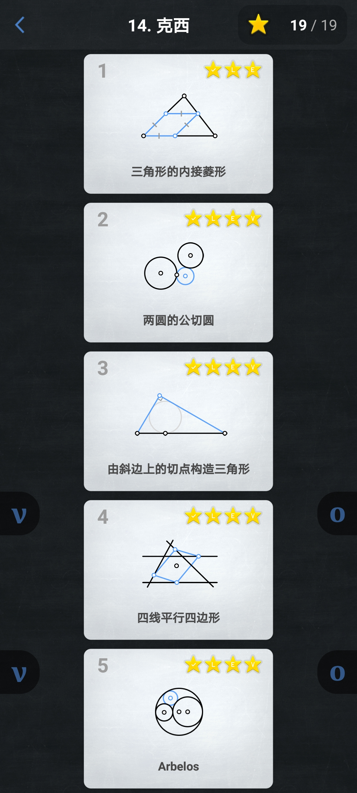

--------
奥密克戎
--------

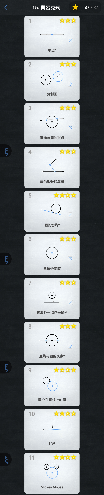
