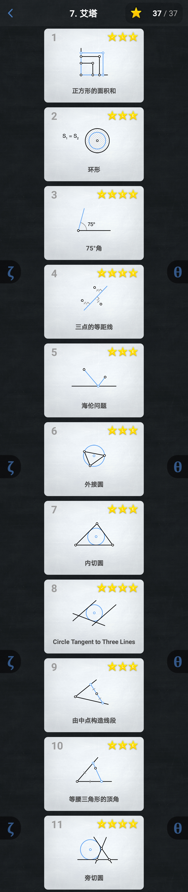

============
Euclidea攻略
============

------
阿尔法
------

.. toctree::
   :maxdepth: 2

   01.Alpha/01.Alpha.rst

----
贝塔
----

.. image:: 02.Beta/02.Beta.jpg

.. toctree::
   :maxdepth: 2

   02.Beta/02.Beta.rst

----
伽马
----

.. image:: 03.Gamma/03.Gamma.jpg

.. toctree::
   :maxdepth: 2

   03.Gamma/03.Gamma.rst

------
德尔塔
------

.. toctree::
   :maxdepth: 2

   04.Delta/04.Delta.rst

--------
伊普西龙
--------

.. toctree::
   :maxdepth: 2

   05.Epsilon/05.Epsilon.rst

----
截塔
----

.. toctree::
   :maxdepth: 2

   06.Zeta/06.Zeta.rst

----
艾塔
----

.. toctree::
   :maxdepth: 2

   07.Eta/07.Eta.rst

----
西塔
----

.. toctree::
   :maxdepth: 2

   08.Theta/08.Theta.rst

----
约塔
----

.. toctree::
   :maxdepth: 2

   09.Iota/09.Iota.rst

----
卡帕
----

.. toctree::
   :maxdepth: 2

   10.Kappa/10.Kappa.rst

------
兰布达
------

.. image:: 11.Lambda/11.Lambda.jpg

.. toctree::
   :maxdepth: 2

   11.Lambda/11.Lambda.rst

--
缪
--

.. image:: 12.Mu/12.Mu.jpg

.. toctree::
   :maxdepth: 2

   12.Mu/12.Mu.rst

--
纽
--

.. toctree::
   :maxdepth: 2

   13.Nu/13.Nu.rst

----
克西
----

.. image:: 14.Xi/14.Xi.jpg

.. toctree::
   :maxdepth: 2

   14.Xi/14.Xi.rst

--------
奥密克戎
--------

.. image:: 15.Omicron/15.Omicron.jpg

.. toctree::
   :maxdepth: 2

   15.Omicron/15.Omicron.rst
