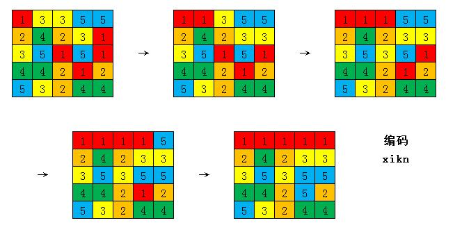
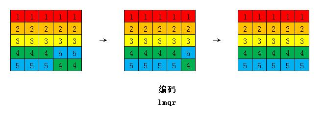

======================
最强大脑之摸金校尉攻略
======================

----
序言
----

做为父女日常联络感情，又拉着辰辰跟我一起看这一季的最强大脑。虽然辰辰完成看不懂，但是好像很喜欢看热闹。从前几季拉各大高校学生参赛以来，赛事题目难度大幅度下降，特别是前几轮的题目，简直就是白给。趁着有空，把上周的“摸金校尉”游戏整理了份攻略。稍加练习的话，可以达到全盲的效果。

----
题目
----

给定5*5乱序棋盘格，如下图，可以平移整行或者竖移整列（超出部分循环到该行列前）。观察棋盘后，棋盘将不显示，靠盲移最终将排成5行相同颜色。游戏过程中允许提交答案三次，提交答案时将短暂展示当前棋盘状态。三次错误即失败！

ps：由于可以提交三次，该题目难度大大降低。本文最终将提高难度，达到全盲。

----
分析
----

该题可分为两部分，第一部分记盘面，第二部分寻找解题策略。

编码及记忆
^^^^^^^^^^

关于编码可以考虑用坐标编码或者独立编码。由于题目共涉及到25个平面方格，数量较少，如果使用坐标编码（每个单元格涉及2位数字，如23表示第二行第三列），需要记忆的数量较多，如果使用独立编码，26个英文字母就足够。第一列可作为默认排序，在移动过程中尽量不变动，所以无需编码，最后确定编码方式如下（为方便记忆调整了部分字幕顺序）。

.. image:: mjxw02.jpg

解题策略
^^^^^^^^

魔方盲拧中有“三循环”，就是通过公式可以实现三个方块的循环移动而不影响其他方块，它的基本原理就是转换机（commutator）。转换机分为4步，第一步A通过直达到B，第二步在不影响AB直达过程中变动的除AB外块的基础上让C交换到达B，第三步直达逆序，第四步交换逆序。最终A到B，B到C，C到A，而其他方块不影响。

该题也可参考转换机原理，只不过第二步交换更简单了，第一步直达用横移，交换就用竖移。下图就是该题的一个简单交换机，可以简单体会一下（2是A，7是B，6是C）。

该题上由于每行颜色相同，所以可以将三循环效果转变为两个交换的效果。如果加上setup和reverse就可以实现任意两个交换的效果。

有了转换机，实际上只要找到找到每行颜色其他四个的位置，套用公式就行（以下为表达方便，用NWSE表示上下左右移动，字母前数字表示行列，字母后数字表示移动步数，如4N2即第4行上移2步）。

这时细心的网友们可能就发现问题了，在置换过程中后序方格会变化，那么记住原始的位置编码还有用吗？这时候就要提到题目的赛制了，题目允许提交三次答案，所以选手也采用的是一次记两行操作两行的办法，这样的话第二行的位置仅经过第一行时一次变化，还是比较容易推理出来的。当然，这篇攻略最终要达到的目的是全盲，所以让我们找个例题，感受一下解题过程，同时补全一下攻略吧（为了方便观察，将颜色按行标上了12345）。

--------
实战演练
--------

例题
^^^^

解答
^^^^

首先是第一行，编码是xikn。举个例子第一1是第二行最后一列，编码为x。x处理方式为2W4 1N1 1W1 1S1 1E1 2E4，之后编码按对应方式处理。

接着是第二行，编码是mfyp。这里我对编码进行了一些小优化，就是对行正确的格编码插入相应的位置，这样可以跳过该格调整（可以自己思考一下）。如图中f编码为行正确格，将f插入myp相应的位置使其保持第二。

继续第三行，编码是yiop。好的，前面提到的问题出现了。如果按初始状态编码，3的编码应该是abgo，现在怎么变成了yiop，而2的初始编码是mfyp，和最后编码一致。这里可以停下来思考一下。

原始是abg都是第一二行编码，在前两后调整时必然受到影响。那么怎么计算最终编码呢？ab是原来第一行的第一二格，对应xikn中的xi，那么abgo就变成了xigo。然后xg是第二行中的第三四格，对应mfyp中的yp，那么xigo就变成了ypio，重新排序yop并插入i，就变成了正确编码yiop。

剩下最后一行。那么让我们根据上述原理推理下最后一行最终编码，然后再对对看。
elqr(原始编码) -> mlqr -> lmqr（最终编码）

总结，最终只需要记住16个字母的编码（xiknmfypyioplmqr），然后熟练应用公式就可以达到全盲了。

至于记忆16个字母编码，可以有多种方法，串联法、记忆宫殿法等等都可以。因为编码很短，建议用串连法速记，新手也可以很容易上手。比如上述编码，我编了个简单的场景记忆。

西可尼（xikn）城有个魔法姨婆（mfyp），唱着一首op（yiop），引来了流氓打穷人（lmqr）。

----
后续
----

时间仓促，简单整理了下思路写的这篇傻瓜攻略。转换机公式、编码规则、还有编码推导应该都有很大的优化空间，网友们也可以尝试思考一下，有建议的话可以一起探讨。网友们有找到好的游戏版本可以分享我一下，这样就可以考虑教小朋友们玩一下了^_^。