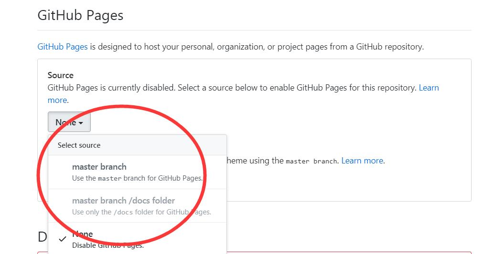

==============
MkDocs快速入门
==============

MkDocs是一个快速、简单的静态站点生成器，面向构建项目文档。文档源文件以Markdown格式编写，并使用单个YAML配置文件进行配置。

----
安装
----

使用Anaconda配置单独的Python环境（mkdocs为自定义环境名称）。

.. code-block:: vim

    conda create -n "mkdocs" python=3

进入python环境（mkdocs为自定义环境名称）。

.. code-block:: vim

    conda activate mkdocs

使用pip安装模块（mkdocs为python模块名称）。

.. code-block:: vim

    pip install mkdocs

检查mkdocs版本信息。

.. code-block:: vim

    mkdocs --version

--------
创建项目
--------

创建项目目录（mkdocs为项目名称）。

.. code-block:: vim

    mkdocs new mkdocs
    cd mkdocs

启动内建服务器（服务器地址 http://127.0.0.1:8000/）。

.. code-block:: vim

    mkdocs serve

--------
编辑项目
--------

项目配置文件为mkdocs.yml。

更改项目名称
^^^^^^^^^^^^

通过更改 ``site_name`` 值更改项目名称（Note为项目名称）。

.. code-block:: vim

    site_name: Note

添加页面
^^^^^^^^

添加 ``nav`` 菜单添加页面（包含Home、MkDocs两个页面）。

.. code-block:: vim

    nav:
    - Home: 'index.md'
    - MkDocs: 'mkdocs.md'

配置主题
^^^^^^^^

配置readthedocs风格主题。

.. code-block:: vim

    theme: readthedocs

--------
项目发布
--------

生成静态页面目录site。

.. code-block:: vim

    mkdocs build

---------------
添加mathjax支持
---------------

`python-markdown-math GitHub地址 <https://github.com/mitya57/python-markdown-math/>`_

`python-markdown-math PyPI地址 <https://pypi.org/project/python-markdown-math/>`_

安装python-markdown-math
^^^^^^^^^^^^^^^^^^^^^^^^

.. code-block:: vim

    pip install python-markdown-math

配置mkdocs.yml
^^^^^^^^^^^^^^

.. code-block:: vim

    extra_javascript: 
        - https://cdn.mathjax.org/mathjax/latest/MathJax.js?config=TeX-AMS-MML_HTMLorMML

    markdown_extensions:
        - mdx_math

行内公式
^^^^^^^^

``\( ... \)``

块内公式
^^^^^^^^

``$$ ... $$``

实例
^^^^

.. code-block:: vim

    当\(a \ne 0\)时，方程\(ax^2 + bx + c = 0\)有两个根：
    $$ x = {-b \pm \sqrt{b^2-4ac} \over 2a} $$

------------------------
配置GitHub Project Pages
------------------------

* 选择GitHub项目设置

* 配置GitHUb Pages

--------
其他文章
--------

* `mkdocs插件：markdown文档自动编号 <https://blog.csdn.net/SHRINKSHR/article/details/90549102>`_

* `Cmd Markdown 高阶语法手册 <https://www.cnblogs.com/andy-zhou/p/4836120.html>`_

* `使用ReadtheDocs托管文档 <https://www.jianshu.com/p/058440ed14df>`_