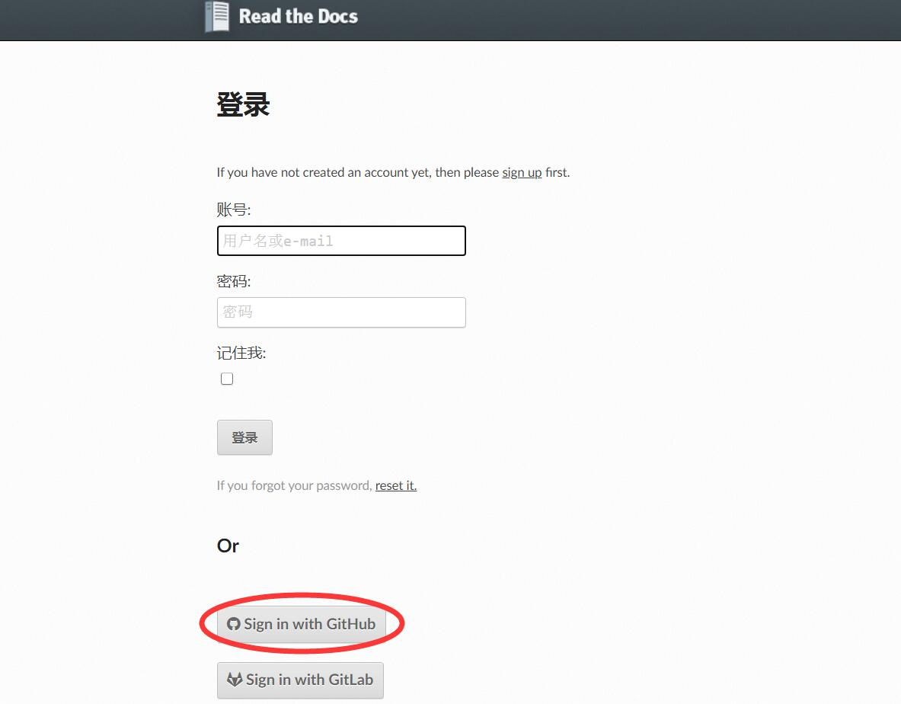
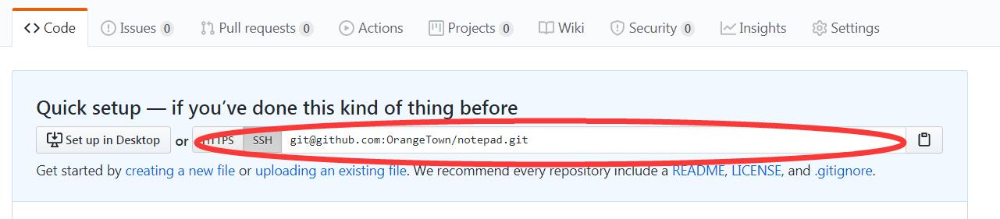
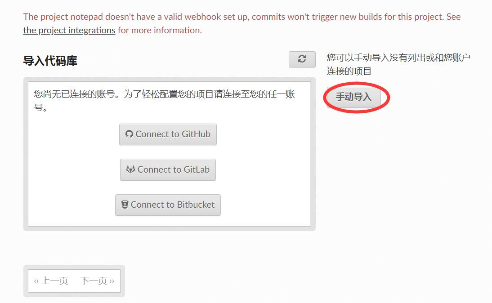
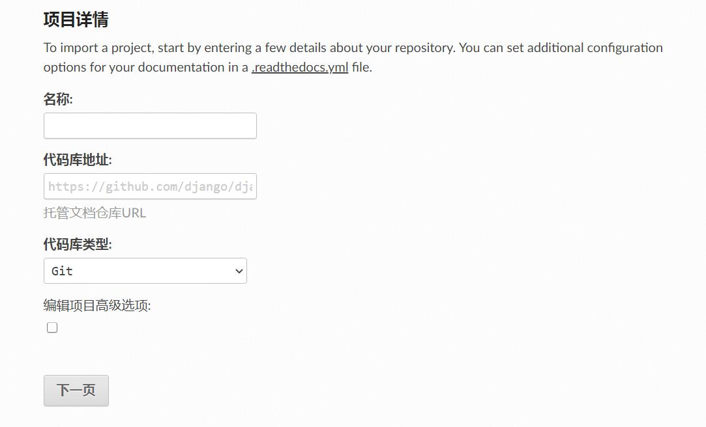
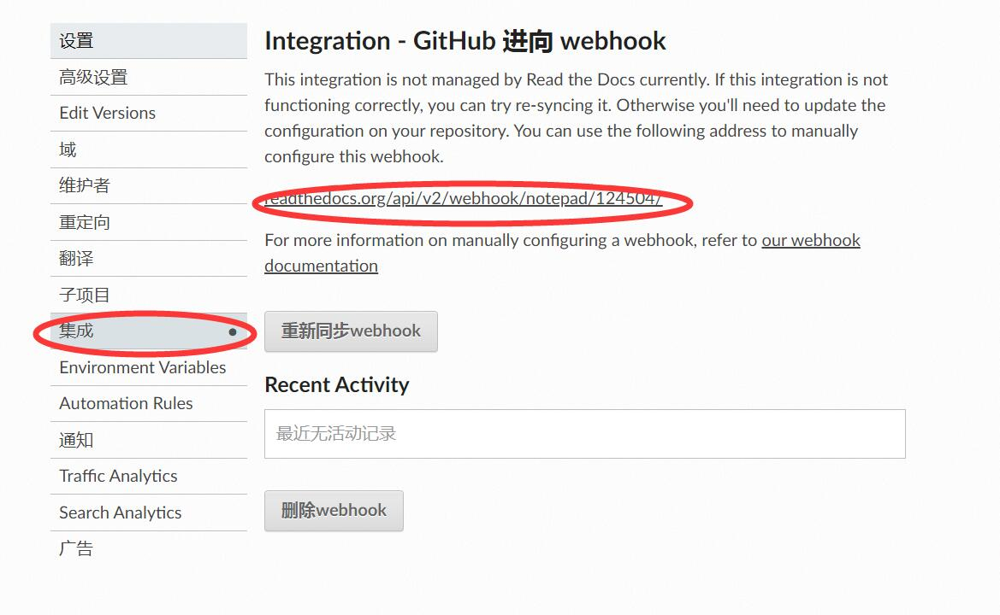
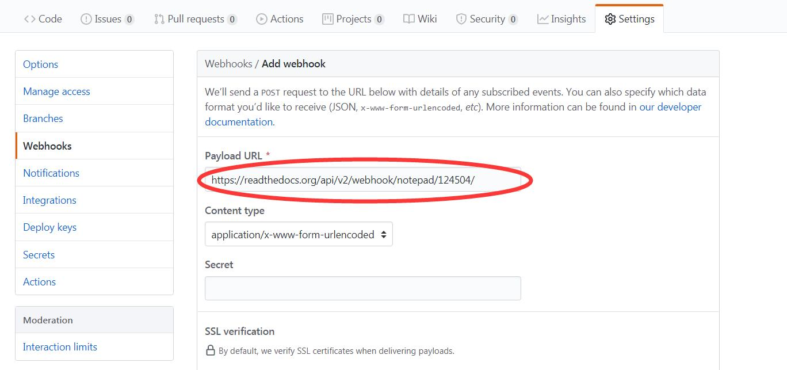

=====================
Read the Docs快速入门
=====================

----
安装
----

使用Anaconda配置单独的Python环境（readthedocs为自定义环境名称）。

.. code-block:: vim

    conda create -n "readthedocs" python=3

进入Python环境（readthedocs为自定义环境名称）。

.. code-block:: vim

    conda activate readthedocs

安装sphinx（readthedocs为项目名称）。

.. code-block:: vim

    pip install sphinx
    cd readthedocs
    sphinx-quickstart

    # 语言支持输入zh_CN，详见：
    # https://www.sphinx-doc.org/en/master/usage/configuration.html#confval-language

添加.gitignore。

.. code-block:: vim

    vim .gitignore
    /_build

使用sphinx_rtd_theme界面优化。

.. code-block:: vim

    pip install sphinx_rtd_theme

修改 ``conf.py`` 配置文件

.. code-block:: python
    :linenos:

    import sphinx_rtd_theme
    html_theme = "sphinx_rtd_theme"
    html_theme_path = [sphinx_rtd_theme.get_html_theme_path()]

生成html文件。

.. code-block:: vim

    make clean
    make html

----------
md文件支持
----------

安装recommonmark。

.. code-block:: vim

    pip install recommonmark

修改 ``conf.py`` 文件。

.. code-block:: python
    :linenos:

    from recommonmark.parser import CommonMarkParser
    source_parsers = {
        '.md': CommonMarkParser,
    }
    source_suffix = ['.rst', '.md']

启用AutoStructify功能。

.. code-block:: python
    :linenos:

    # At top on conf.py (with other import statements)
    import recommonmark
    from recommonmark.transform import AutoStructify

    # At the bottom of conf.py
    def setup(app):
        app.add_config_value('recommonmark_config', {
                'url_resolver': lambda url: github_doc_root + url,
                'auto_toc_tree_section': 'Contents',
                }, True)
        app.add_transform(AutoStructify)

--------------------
配置sphinx-autobuild
--------------------

在项目目录下执行sphinx-autobuild。

.. code-block:: vim

    pip install sphinx-autobuild
    sphinx-autobuild ./source ./_build/html
    # sphinx-autobuild ./source ./_build/html -H 127.0.0.1 -p 8080
    # 自定义ip和端口

---------
配置nginx
---------

除了配置sphinx-autobuild，还可以使用nginx启动本地服务。

`nginx官网地址 <http://nginx.org/en/docs/windows.html>`_

nginx配置文件路径 ``conf\nginx.conf`` 。

常用命令
^^^^^^^^
.. code-block:: vim

    start nginx		启动
    nginx -s stop	快速停机
    nginx -s quit	优雅停机
    nginx -s reload	重载配置文件

---------------------
Read the Docs创建项目
---------------------

`readthedocs官网地址 <https://readthedocs.org/>`_

注册Read the Docs账号
^^^^^^^^^^^^^^^^^^^^^

如验证码页面打开太慢，可选择登陆后，选择Sign in with GitHub跳过验证码页面。

新建GitHub项目
^^^^^^^^^^^^^^

本地电脑clone GitHub项目。

.. code-block:: vim

    git clone git@github.com:OrangeTown/notepad.git
    git add .
    git commit -m "init"
    git push origin master

发布到Read the Docs官网
^^^^^^^^^^^^^^^^^^^^^^^

如在编译时遇到以下错误： ``Sphinx error: master file [..]/checkouts/latest/contents.rst not found`` ，修复方法是修改sphinx项目的 ``conf.py`` 添加以下的一行： ``master_doc = 'index'`` 。

增加WebHooks
^^^^^^^^^^^^

启用Read the Docs的WebHooks功能。

GitHub设置WebHooks。

